# Introduction

## Intended Learning Outcomes {-}

By the end of this session you should be:

1. Familiar enough with a computer to *open, save and access previously saved files*.
2. Able to *describe R and Studio, the coding environment and the associated file types*.
3. Able to *install, load and describe the nature of R packages** and **describe the nature and use of functions in general*.

This lesson is led by [Rebecca Lai](http://www.psy.gla.ac.uk/staff/index.php?id=RL003).

## Computer Literacy Basics

In order to successfully navigate this course there are a number of things that you need to know about computers more generally. This section here should be everything that you are *required* to know or learn. 

We are aware that many people will have been using computers for many years, and in some cases many people will have grown up with them in their household. We have noticed, however, that a number of our incoming students are not familiar with many of the basic concepts that are required to be a successful coder. There is an assumption that "digital native" automatically equates to "computer literate" but in many cases we have found this assumption to be incorrect.

More people than ever before are using some sort of personal computing device, but the type of use differs greatly from what we are going to be doing over the next 10 weeks. Many mobile phones, tablets and (increasingly) PC operating systems hide many of their operations from users. This can create a feeling of compentency with computers that can quickly dissolve when asked to engage with anything slightly more complex.

If you already know most of this then we apologise, but there may well be people with us who don't. This is a beginner class, so we thought it prudent to start us all off on the same footing.

## R and R Studio

Are they different? Yes! Is this important? Yes!

### R 
 

R is a programming language and completely free software, and it is widely used for data analysis. It is a stand-alone program and can be run on it's own without R Studio, but it's not particularly user friendly.

<center> 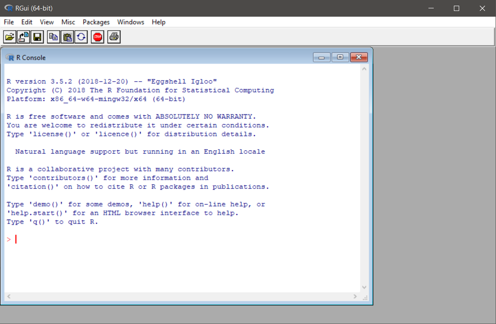 </center> 

### RStudio IDE 
 

RStudio IDE (short for **I**ntegrated **D**evelopment **E**nvironment) is essentially a shiny facade, which sits atop R and gives it all sorts of useful features and makes it much *easier to use*. 

When you first open it you get 3 main panels, which can be seen in the picture below.

<center> 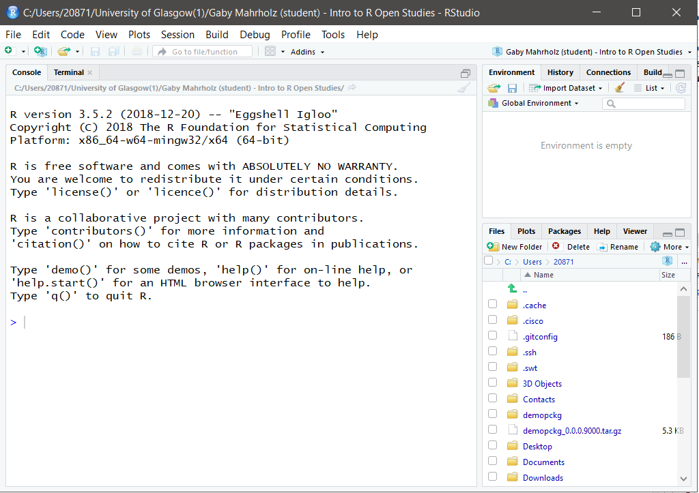 </center>

#### Console

This is essentially the same thing as R commander. You can run code in here, and it can be a useful playground to try out new things and do things that you don't neccessarily want saved into a script because **it's not permanent- anything typed here will be lost when you close R**!

Examples of things you might want to run in the console include, but are not limited to, running new functions and seeing what they do, or installing packages (never EVER done in a script). 

This is what the console looks like before you have run any code:

<center> 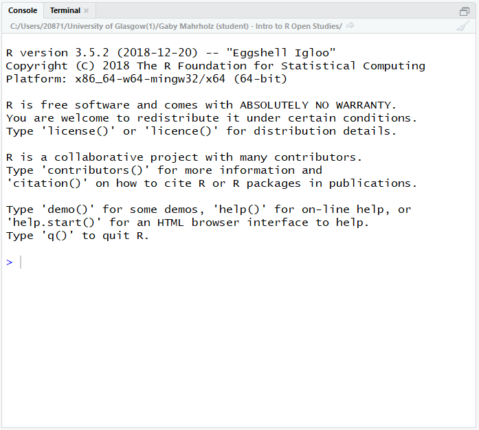 </center>

#### Environment/History/Connections

This panel is tabbed, with 2 tabs that you need to pay particular attention to right now:

- **Environment**: this contains all of the virtual "objects" that you have created. These include, but are not limited to, variables containing data that you have read in, lists, individual values, custom-written functions.

    Objects can and should be created in your scripts. When you close R you might lose some of the objects, but as long as you have the script containing the instructions to re-create these objects you can re-run it and make them again.

- **History**: this is a list of all of the commands that you have run in the past "session", which can be useful to go back to some times if you did run some code in the console that you want to look at again. To scroll through you can put the cursor in the console window and use up and down keys.

At this point you don't really need to worry about the one called connections (it lets you connect to things like online data sources and stuff).

This is what that panel looks like for me right now... it's empty!

<center> 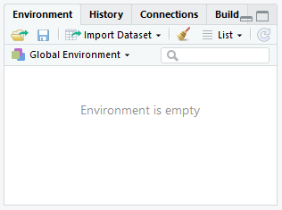 </center>

#### Files/Plots/Packages/Help/Viewer

This panel set is going to be mega-useful to you throughout the duration of your career as an R user. Viewer is not immediately required, so we'll just cover Files, Plots, Packages and Help.

- **Files**: Shows a file browser that let's you look around in your file structure. helpful hint: click on the more button and "Go to working directory" to see the same files that R can see. **You *can* load files in through this tab, but you should always strive to do it in the script!**

- **Plots**: A tab that displays plots that you have made. You can navigate backwards and forwards between multiple plots- allowing you to test out new things and see the changes in comparison to each other.

- **Packages**: This allows you to look at the R packages that are installed on the machine that you are using, and the check box next to it indicates if it is loaded in from the library. **You *can* click the box to load a package, but you should always strive to do it in the script!**

- **Help**: this window displays the built in help information, much the same as Microsoft Word or Powerpoint has. You can search using the search box, but you can also type into the console. For example, if I wanted to find the help file for the `library()` function I would type `?library`. the result is displayed in the help tab to the right.

<center> 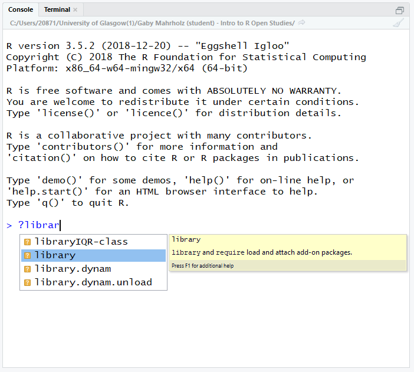 </center>

  Alternatively, you can type the name of the function you want help with into the search box in the help tab:

<center> 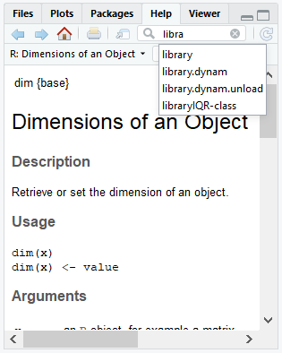 </center>

Sometimes these files are not exactly written in a manner that could be considered accessible to novice users. You get the hang of reading them over time. In this case you might want to try Googling it... we **all** do it, no matter our level of experience! 

Even Googling can be difficult, but you will eventually get a better idea of the types of search terms most likely to direct you to the information that you are after. 

## R, R Studio and Associated File Types

When you open a program, such as Microsoft Word, you haven't actually created a Word document you've just started the program. Opening RStudio is much the same. Even though it can function without opening a file, there is much utility to be added by opening a file. 

When you open a file, the console will shrink and the space taken away in the window will be taken up by the new file.

Opening a new file allows you to write code that can be saved, amended, shared etc. Code sharing is an important aspect of reproducibility!

R can handle a lot of different files types, we will only focus on the two kinds that we learned about in the first semester. These are .r and .Rmd files. Both are saved as plain text files. Many of the files R uses are plain text files at their core. What changes is how R interprets the files, and the types of outputs that you can get from them.

### File Structure/Directories

Your files should be stored in something called **"directories"**. This is the technical name for a folder. It is a storage space on your computer. Here you can see all of the files contained within the folder for this course document in the **"File Explorer"**, the programme used to view files and folders in Windows:

<center>  </center> <br>

Each folder and the files within will have a specific **"file path"**, an address within your file storage system that allows you and the computer to pinpoint the location of the information that you and it need to perform tasks involving that file. In windows you can get the file path of a folder by clicking on the bar at the top of the folder when you are looking in it in the file explorer:

<center>  </center> <br>

This will be neccessary later when you start to use RStudio in conjunction with external files, such as data files.

### File Extensions

Files come in different types, and each different type comes with a different **file extension**, meaning that it is associated with a different type of program. A **file extension** is that part after a full-stop in the file name. Some common ones are:

- .xlsx: a spreadsheet file associated with Microsoft Excel
- .docx: a formatted text document associated with Microsoft Word
- .pdf: a **P**ortable **D**ocument **F**ile, commonly text and images, associated with Adobe Acrobat
- .txt: a plain text file, can be opened in multiple programs such as Notepad or other word processing software.
- .zip: a *compressed folder* which can contain many files. These files must be *uncompressed/extracted* before you use them successfully.

### .zip Files

In this course we will often ask you to download a folder with multiple files and this will be stored on the server as a zip file. A zip file is a folder that contains files that have been compressed to make the file size smaller and enables you to download multiple files at once, however, before you use the files from a zip folder you first need to extract them.

1. Click on the link to download the compressed folder.
2. Navgiate to the zip file (probably in your downloads folder) and open it. You will see all the files it contains but don't use these - click "Extract all" on the top ribbon.
3. You will be asked to select a location to save the unzipped files. Normally the default location it suggests will be the same folder and so you can just click "Extract". If you want to unzip these files to a different place click browse and select the folder you want to keep it in. I like to keep all the files for one project in the same folder.
4. You can now delete the zip file and use the unzipped files. This is a really important step - if you use the compressed files your code may not work properly. This usually causes error messages relating to temporary files.

<center> <figure><figcaption>Adapted from Level 1 Data Skills, [@l1book].</figcaption></figure> </center> <br>

### RStudio Specific Files

RStudio uses many different types of files, but each is a variation on a **"plain text" file**. This means that all files we will be using in class will be able to be opened in Notepad or other similar text programs. The three main ones we will be working with will be:

- .r: an R script
- .Rmd: an RMarkdown document
- .csv: **C**omma **S**eparated **V**alues file, a common and universal type of file containing data sets.

```{block, type = "danger"}
If the file extension on a file is incorrect it may not be recognised as a file to be opened with a specific program and might not work.

This is particularly an issue when you are downloading your files for class. As they are technically "plain text" files, some internet browsers will download them with the extension ".txt", or even add it on as a second one which doesn't work! Changing the extension to ".Rmd" or removing the extra added one will solve this issue.
```

### .r Files

This is what we refer to as a script. It is designed to be read by R, not so much by humans. To create a new script go to File > New File > R Script. This is what will be brought up:

<center> 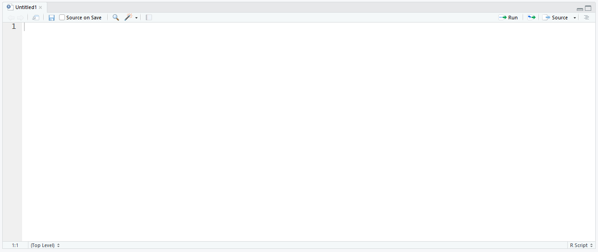 </center> <br>

All of the text in an R script will default to being read as **executable code (that is, text which is directed at the machine)**. We can, however, tell R **not** to read it as executable code, but instead for the machine to ignore certain parts of it, by using something called **comments**- you will read more about these below.

### .Rmd files

These are the types of files that you will mostly be using during this class. You will be given some pre-formatted ones to complete your assessments on also. 

When you go to File > New file > R Markdown... you will be prompted to supply some information. You can do this, but don't have to as you can change many of these parameters later:

<center>  </center> <br>

When a new RMarkdown file is opened the file isn't empty. What you actually get is an example with a YAML header (at the top bordered with the dashes), some code chunks (in the shaded sections, more on these in a minute), text and some headers (the hashtagged blue text **outside** of chunks).

I like to think of the way this file type is interpreted as being *like a script, but flipped*- the default interpretation of text aimed at humans. If we want **executable code** we need to prompt R to read the text in this way. This is done using "code chunks", or sometimes just called "chunks".

<center> 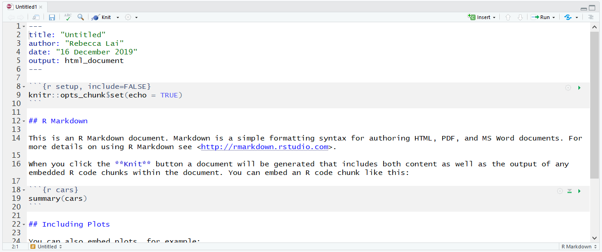 </center> <br>

#### Code Chunks

Code chunks are bordered by "backticks", which look an awful lot like apostrophes but they are different! These are important as they tell R where it needs to start and stop reading. 

Chunks also contain "curly brackets" at the start which contains various bits of information neccessary to how the computer reads it. This includes what programming language you are writing in there (yes! R can understand other programming languages!), name of the chunk (used for a variety of reasons, such as our marking software and document indexing) and other attributes which are not neccessary to learn about right now. 

<center>  </center> <br>

```{block, type = "danger"}
The chunk **must** have the backticks to show the beginning and end of the executable code, otherwise the code doesn't run. 

You must not add any code or text to the lines which contain backticks other than the code to alter the attributes of the chunk within the curly brackets (and only if you know how to do so). If you do this the code will not run and other chunks in the document might also be affected.

```

Hastags used inside of code chunks don't result in headers, but rather are ignored as the comments discussed in the section about .r files.

## Comments

Comments can- and should- be used throughout both .r and .Rmd file types. These are anything written *after* a hashtag symbol (and, if using a .Rmd file, within a code chunk). This symbol instructs the computer to disregard this text, letting it know that this is not for it to interpret as exectuable code but rather it is something for the human user to read and interpret.

These are handy for letting others know what each piece of code was written to do, or to inform your future self of what you were doing.

Make use of comments in the code we write in class and let this function as your class-notes.

```{r comment_example}
# this is what a comment looks like. Anything AFTER a hashtag.
# R doesn't "speak" natural languages so it would not be able 
# to understand any of this and would give errors!

# comments are for humans. You can use them to put notes in scripts to
# remind yourself of what is happening, or to inform people with whom
# you have shared your code.
```

## Saving your file

As mentioned before, anything in the console vanishes when you close R. Any objects that you have used code to make (those things that live in the environment) should vanish too.

Your script is a set of instructions on how to make those objects. If you have saved your script or markdown, you can essentially re-run it and get back to where you left off when you last saved your progress. 

Saving your file for the first time is as easy as going to File > Save As and filling in the details in the dialogue box as appropriate:

<center>  
 </center> <br>

Saving changes to an already existing file is done by going to File > Save:

<center> 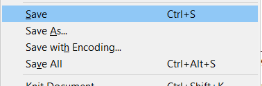 </center> <br> 

## Sessions

### What is a session in R?

A session in R is a segment of time/workspace/processor time that is dedicated to performing a specific processing or analysis task. It can be difficult to wrap your head around at first, but it helps to draw comparisons with software that we are already familiar with.

Let's go back to Microsoft Word. We can have an essay open in one window and class notes opened up in another window. Both are instances of Word, but they are dedicated to two different tasks which just so happen to be running concurrently.

You can have multiple sessions open in R, but I wouldn't recommend it because it can become confusing. We can start a new session by going to Session > new session. We Are much more interested in a task which is closely linked to this idea- restarting your current session.

<center>  </center> <br>

### Restarting Your Current Session

This can be done by going to Session > Restart R, see the image above.

Restarting your R session does some important things:

* it clears the environment of objects if R is set up in a maximally reproducible way- so make sure your script is saved so that you keep the instructions for making them again
* it "unloads" packages that you have called from the library using the `library()` function
* If you encounter an error with an unknown source sometimes restarting the session can clear the problem
* It allows you to test the reproducibility of the script that you are writing by clearing the environment and starting over with only the instructions you have provided, without the possibility of "contamination" of objects inadvertently created in other ways, such as playing in the console

## Packages

R is a programming language which is primarily used for data processing and analysis. As the software is open source a number of people have created extensions to the software to adapt it to their needs.

These software extensions are referred to as "packages".

### Installing Packages

There are a number of functions that we will be using in this course that are not part of the original programming language. The most common package we will be using will be one called "Tidyverse".

We will use the example of Tidyverse to show you how to install packages that you might need.

#### What is Tidyverse? {#install-tidyverse}

```{block, type = "danger"}
Do not install any packages on the university machines. All the packages you need are already installed. You would only need to install packages if you are using your own machine.

You must also never place `install.packages()` in any r script or RMarkdown document: installing it a second time can break the installation and by sharing this script you would be attempting to force others to install it on their machines.

This is at best rude and at worst it can break their installation.
```

Tidyverse is a "metapackage"- a package that is actually a collection of packages that have been bundled together. It was developed by Hadley Wickham. You can read more abut the package <a href="https://www.tidyverse.org/">here</a>.

#### `install.packages()`

When you install a package, you should do this in the console part of the interface, as shown here:

<center>  </center>

Types the following in and then hit "enter":

```{r install_packages, eval = F}
> install.packages("tidyverse")
```

Note that the name of the package is in quotation marks when used here. This is not always the case!

The console will then fill with a lot of text showing you what is being done. It is not neccessary to understand all of this. 

Look out for this message being printed in the console

<center></center>

This indicates that the package has been installed successfully. There will be many of these messages for different packages. There may even be parts after this message if the computer determines that other "dependencies" (additional software that tidyverse requires to run) are required. 

Once R has stopped working (doing it's current task) the `>` will reappear in the console. This symbol reappearing means that R is ready for further code.

To install other packages you would reuse the **function** `install.packages()`, replacing the name "tidyverse" with the name of the package you want to install. 

We will cover functions shortly.

### Loading Packages {#load-tidyverse}

Now that we have installed Tidyverse it is on our machine but it is not ready to use yet!

It is easier to understand if you think about it like this: if you install Instagram on your phone you only do it once and you have to open the app each time you want to use it.

Similarly, once Tidyverse is installed it is on your computer until you remove it. If you want to use it you need to "open it". This is done by using another **function**, `library()`.

```{r library, eval = F}
library(tidyverse)
```

This must be done before you use Tidyverse. We normally do this in the first chunk in the document, essentially gathering our tools before we start working.

If you want to load other packages you would reuse the **function** `library()`, replacing "tidyverse" with the name of the package you want to load.

## Functions

"Function" is a word that you will hear a lot in this class. But what are they? What do they look like? what are they made up of?

### What is a function?

If I were to tell you to jump, you would understand the action I was asking you to perform wouldn't you? But before you carry it out you might ask me a question in return: how high?

This is what a function is for R... it's a command that tells R to do something. It just does it in a way that R understands.

### The Anatomy of a Function: names and arguments

Functions are made up of elements. See the code chunk below:

```{r eval = F}
function_name(argument1, argument2, etc...)
```

The part outside of the brackets is the **name of the function**. This tells R exactly what to do- the action to be performed. The parts inside the brackets are called **arguments**... these provide information to R on what to perform the actions on (and input) and can provide information on slight changes to the actions.

```{block, type = "info"}
Essentially the function name is the action to perform (jump) and the arguments give information on how to perform the action (how high).

Think about `install.packages("tidyverse")` and `library(tidyverse)`: what are the function names and what are the arguments? Which part changes when you want to install and load a different package?
```

Once your function has taken the input and run the command on it it will produce an output of some sort. 

As we progress through this course see if you can spot the functions, the arguments, the inputs and the outputs.

## Formative Assignment

This formative assignment is an important one as it will enable you to complete your future assignments. It looks long, but it is mostly screenshots to guide you through the process of installing the required software, or a short guide on how to use RStudio Cloud.

### Access to RStudio {#accessing}

Please ensure by the next class that you have access to the software so that you can practice using the formative assignments and complete the summative assignments when they are issued.

The first summative assignment will be issued after class next week and you will be given one week to complete and submit it. 

#### Installing R and RStudio on Your Own Machine

Unfortunately this is not as simple as installing software normally is on your computer. There are two separate things that you will need to install.

##### First: Install R

Follow <a href="https://www.stats.bris.ac.uk/R/">this link</a> and click on the part that says Download R 3.6.2 for Windows. You will get the following pop-up dialogue:

<center></center>

Click "Save File". The file will then be downloaded to your computer, most likely the "Downloads" folder unless you have changed your settings. Double click to run the file.

You will be asked if you want to allow this to make changes to your computer, click yes. Select your language preference, review the license agreement and click next. The following screen will be presented:

<center>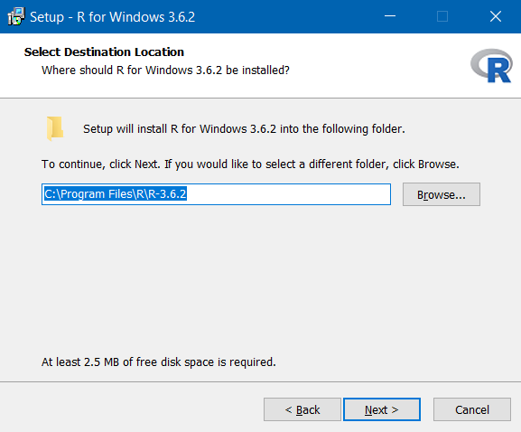</center>

Click next without changing the folder. The next screen let's you customise the installation, but we shouldn't need to make any changes at this point so click next without unselecting any components:

<center>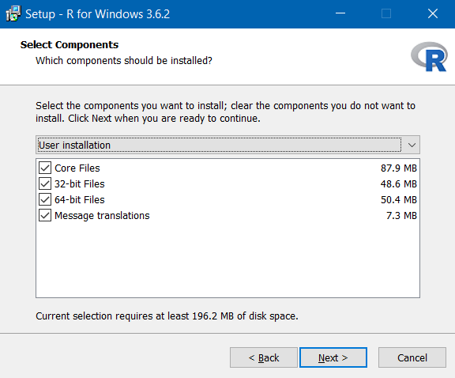</center>

Also leave the star-up options as standard and click next:

<center>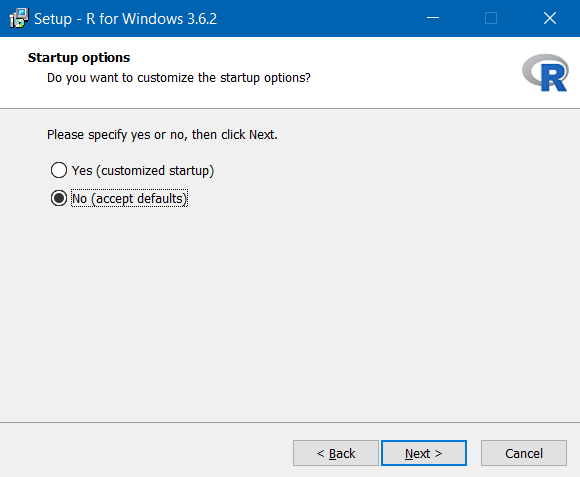</center>

Leave the start menu folder as standard:

<center></center>

Don't make any changes to the additional tasks part, just click next:

<center></center>

The Install Wizard will then install R:

<center>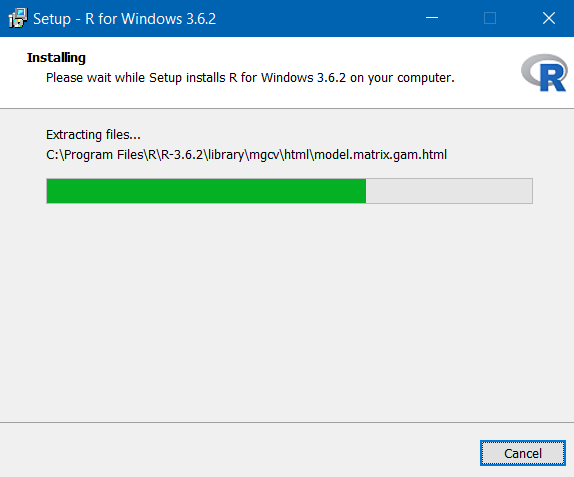</center>

You will be told when installation is complete:

<center>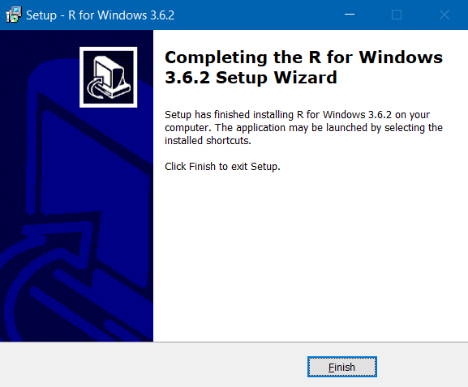</center>

##### Second: Install RStudio

Follow <a href="https://rstudio.com/products/rstudio/download/">this link</a> to the RStudio website. Scroll down and press the button "Download" under RStudio Desktop- not the Server Option. On the next page press the button under stage 2, "Download RStudio for Windows". Your download will start and you will see the following prompt:

<center>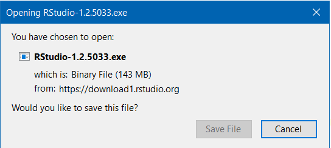</center>

Click "Save File" when the button becomes active.

Look in your download folder and double click the downloaded file. Click to allow the program to make changes to your computer. You will see this part next:

<center>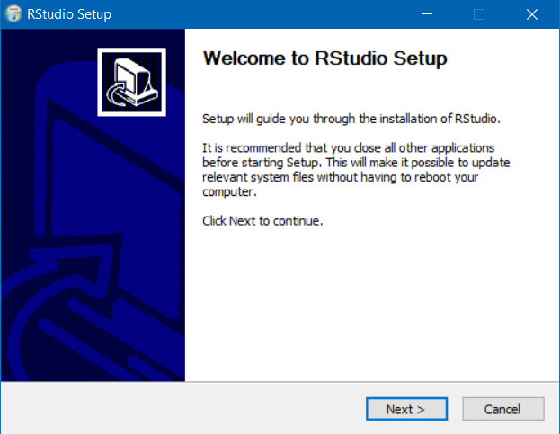</center>

Click next on this next window. Do not change the installation location. Click next:

<center></center>

You will be taken to this screen. Again, don't change the start menu folder location here. 

<center></center>

Click next and the installation will begin:

<center></center>

You will then be notified when the installation is complete with this screen:

<center>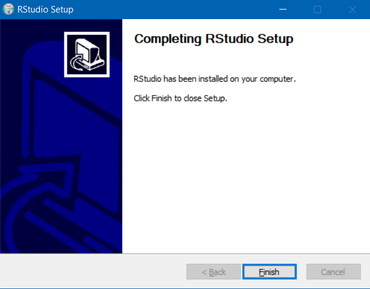</center>

##### Opening RStudio

Remember that we have installed **two** programs on our computer. R, which is the base program, and RStudio, which is an extension of R.

The software that we want to open and use is RStudio, not R. We want the shiny interface and added features.

#### Accessing RStudio on University Computers

If you have a student card you will be able to access computing facilities provided for students, including those in the various libraries across campus. All university computers should have R and RStudio installed, as well as the required packages for this course. 

You will not be required to install anything on university computers, please don't attempt to do so because we don't want the IT guys to yell at us.

To login to the university computers you will require your GUID and password.

#### Using RStudio Cloud

We recognise that not all students will have access to their own computers, and that some of those students will not be able to travel to campus to use the provided facilities. For this reason we recommend to those in that postition to think about using RStudio Cloud, available [here](https://rstudio.cloud/). 

The RStudio Cloud allows you an electronic workspace, hosted by the RStudio team themselves.

Navigate to the page and click the "Sign Up" button at the top right-hand side of the page. 

Once you are logged in you will see your (for now) empty workspace:

<center>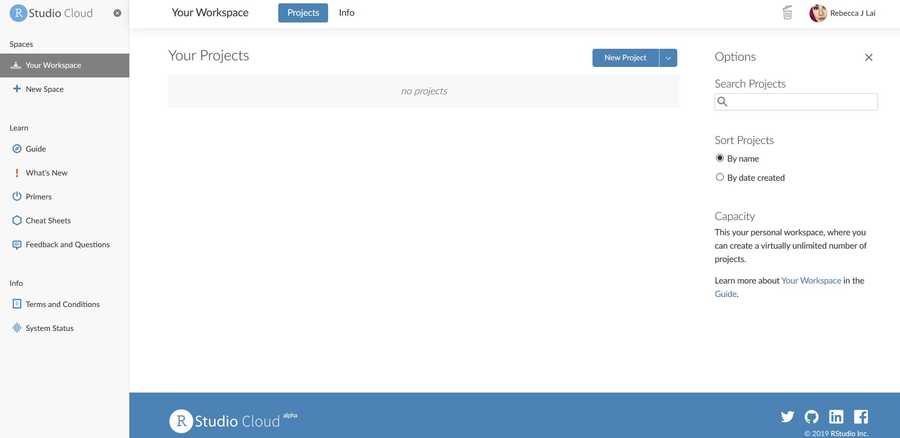</center>

Click on "new project" and you will be taken to this page:

<center></center>

As you can see it is almost identical to the way the program would appear on your computer if you had installed it there.

To name your project you can click the name at the top of the page and type in a new one:

<center></center>

You will also need to upload any data files to the server before you can work with them. This is done with the 
addition to the panel Files/Plots/Packages/Help/Viewer on the right- the "Files" pane now had a button to upload:

<center></center>

Pressing this will open a pop-up box. Click on the "browse" button, navigate through your directories and identify the file you wish to upload and confirm. Then press ok. The file should then be uploaded and displayed in the files pane.

<center></center>

```{block, type = "info"}
If at any point you are struggling to access the required materials or software it is important that you contact the tutors **at the earliest opportunity** to discuss the issues you are having. 

We want you to do well and have a good experience learning with us, let us know if you are experiencing difficulty so that we may help you resolve it!
```

##### Downloading Your Files from RStudio Cloud

If you are using RStudio Cloud your files will be saved on the cloud, but you will need to download the .Rmd files that you have been working with (containing coursework etc) to upload them to the assignment submission pages on Moodle. 

Here you can see the file `myfile.Rmd` that I have made on the cloud. To download it I select the checkbox next to the file and click on the "More" drop-down menu and click "export", as shown here:

<center></center>

I then get a dialogue box asking me if I want to name the file something different. I will stick with the original name, so I just click "Download":

<center></center>

Now I get a pop-up as I would when downloading any other file. To save the file ensure "Save File" is selected and click "OK":

<center></center>

The file will then be saved in the folder where your downloads are saved (usually the "Downloads" folder by default). You can then navigate to this file when browsing files to upload to Moodle.

### Maximising Reproducibility and Visibility

In order to set up R the way that we require, there are a few more steps. 

First, open RStudio and click on the Tools menu at the top of the page and click on the part that says "Global Options":

<center></center>

Next, a dialogue box will open. Ensure that these tick boxes and options are selected on yours and click apply:

<center>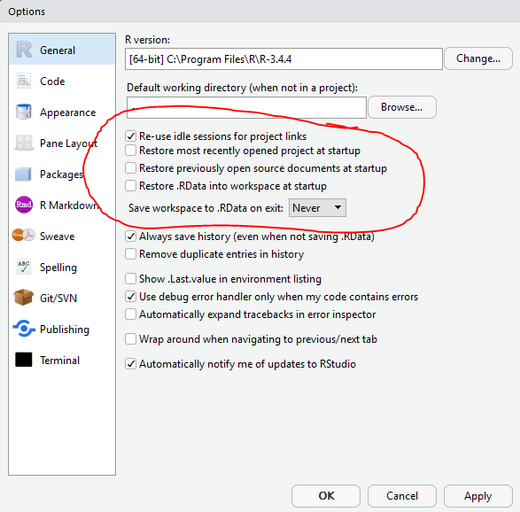</center>

Finally, go to RMarkdown and ensure that this option is unchecked:

<center></center>

This meaning of the first part will be discussed in future lessons, and the second will mean that graphs that you make will be in the "Plots" tab to the right of the console. This means that code will not be obscured whenever you make a graph.

### Installing and Loading Tidyverse

Use the information in the section \@ref(install-tidyverse) above to install the Tidyverse package on your RStudio installation.

```{block, type = "info"}
If you are using RStudio Cloud you are provided with a completely self-contained computing environment. This means that you can `install.packages()` on your virtual RStudio too as required.
```

Load Tidyverse from the using the `library()` function in section \@ref(load-tidyverse). *For now* you can do this in either a new .r file, .Rmd file or even in the console. 

If you successfully load it you will see this printed in the console:

<center></center>

You will be using the Tidyverse package in the next lesson, so don't worry if you struggle with this at the moment.
