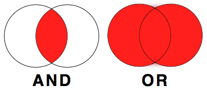

# Data Transformation 1: Basic One Table Verbs

## Intended Learning Outcomes {-}

Be able to use the following dplyr one-table verbs:

* select()
* arrange()
* filter()
* mutate()

This lesson is led by [Kate Haining](http://www.psy.gla.ac.uk/staff/index.php?id=KH001).

## Data Wrangling

It is estimated that data scientists spend between 50-80% of their time cleaning and preparing data. This so-called **data wrangling** is a crucial first step in organising data for subsequent analysis (NYTimes., 2014). The goal is generally to get the data into a "tidy" format whereby each variable is a column, each observation is a row and each value is a cell. The `tidyverse` package, developed by Hadley Wickham, is a collection of R packages built around this basic concept and intended to make data science fast, easy and fun. It contains six core packages: dplyr, tidyr, readr, purrr, ggplot2, and tibble. 

`dplyr` provides a useful selection of functions - each corresponding to a basic verb: 


| dplyr function | description  |
|:----------|:---------------------------|
| select() | Include or exclude certain variables (columns)  |
| arrange() | Reorder observations (rows) |
| filter() | Include or exclude certain observations (rows) |
|	mutate() | Create new variables (columns) and preserve existing ones |
|	group_by() | Organise observations (rows) by variables (columns) |
|	summarise() | Compute summary statistics for selected variables (columns) |

These are termed **one table verbs** as they only operate on one table at a time. Today we will focus on select(), arrange(), filter(), and mutate().


## Pre-Steps

Before we can talk about today's data, let's do some house-keeping first.

### Downloading materials

Download the materials we will be working with today either from <a href="data\L3L4_data.zip" download>here</a> or from moodle. The zip folder that contains an Rmd file called `L3L4_stub`, a data file called `Student_Mental_Health.csv`, a data file called `Anx_Emp.csv` and the paper "A Dataset of Students' Mental Health and Help-Seeking Behaviors in a Multicultural Environment" (Nguyen et al., 2019). Similar to last week, `L3L4_stub` contains all code chunks for today's lesson, and is intended for you to add notes and comments.


### Unzipping the zip folder

Make sure you **unzip the folder** and check it contains the `L3L4_stub.Rmd`, `Student_Mental_Health.csv`, and the Nguyen paper. 


### Setting the working directory

Set that folder as your working directory for today. The files in the folders should now be visible in the `Files pane`.


### Load tidyverse into the library

As we will be using functions that are part of `tidyverse`, we need to load it into the library.

```{r L3, message=FALSE}
library(tidyverse)
```


### 	Reading in the data

Today, we will be using the following data file `Student_Mental_Health.csv`. This contains demographic and mental health data for 268 students at an international university in Japan. The full version of this open access dataset and accompanying publication are available at https://www.mdpi.com/2306-5729/4/3/124. There is also a copy of this paper in today's data folder.


Now, you need to read the .csv file containing your data into your `Global Environment` using the function `read_csv()`. Remember to store your data in an appropriately named object (e.g. `student_MH`).  

```{r, message=FALSE}
student_MH <- read_csv("Student_Mental_Health.csv")
```


### View the data

Either click on `student_MH` in your `Global Environment` to open your data in a new tab on the `Source` pane or call the object in your `Console` (by typing the name of the object `student_MH`) to check that the data was correctly imported into R.

```{r}
student_MH
```


```{block, type="funfact"}
You could also view the data by using the function `View()`. If you are more of a typer than a mouse-user you can type `View(student_MH)` into your `Console`. This will open the data in a read-only, spreadsheet-like format in a new tab on the `Source` pane.
```


Remember from last week, we can also use `glimpse()` to view the columns and their datatypes.

```{r}
glimpse(student_MH)
```

`head()` would be helpful in displaying only the first 6 rows of the dataset, but remember not to get "tricked" by the number of observations shown in the output.

```{r}
head(student_MH)
```


<span style="font-size: 22px; font-weight: bold; color: hsl(24, 100%, 50%);">Question Time</span>

How many rows (or observations) does `student_MH` have? `r fitb("268")` <br>
How many columns (or variables) does `student_MH` have? `r fitb("19")` <br>


```{block, type="task"}
Take 10 minutes to read the `data description` section of the Nguyen publication in order to familiarise yourself with the variables in your dataframe. 
```


## select()

You may not want to include every single variable in your analysis. In order to include or exclude certain variables (columns), use the `select()` function. The first argument to this function is the object you want to select variables from (i.e. our tibble called `student_MH`), and the subsequent arguments are the variables to keep.


For example, if you wanted to keep all variables except from `ID`, you could type:

```{r}
select(student_MH, inter_dom, Region, Gender, Academic, Age, Stay_Cate, Japanese_cate, English_cate, ToDep, ToSC, APD, AHome, APH, Afear, ACS, AGuilt, AMiscell, ToAS)
```

Uuuuiiii. That was long and it would have taken us loads of time typing it out. There are two ways on how we could have done this easier and faster:

1. We could use the colon operator `:`. Similar to last week where we used the colon operator for numerical sequences, we can use it here for selecting a sequence of column names. Here, it reads as "take object `student_HM`, and select columns `inter_dom`, `ToAS`, and everything in between".

```{r}
select(student_MH, inter_dom:ToAS)
```

2. We could use "negative selection", i.e. select the variable we wanted to drop by adding a `minus` in front of it.

```{r}
select(student_MH, -ID)
```

We also have the option of "de-selecting" more than one variable. Let's say, we had no interest in any of the seven subscales for `ToAS`, we could exclude them by combining the colon operator `:` with the `minus`. Watch out that you include the `minus` in front of both reference columns.

```{r}
select(student_MH, -APD:-AMiscell)
```

This only works, because they are all next to each other in the tibble. If we wanted to exclude columns `ID`, `Academic`, and `ToAS` that are not neighbouring each other, we would need to list the arguments separately, and insert a `minus` before each variable name.

```{r}
select(student_MH, -ID, -Academic, -ToAS)
```


```{block, type="funfact"}
We can also use `select()` in combination with the `c()` function. Remember, `c()`is "hugging things together". We would put a single `minus` in front of the c rather than each of the column. This will read as exclude every column listed within the brackets.

select(student_MH, -c(ID, Academic, ToAS))
```


Remember, if you don't save this data to an object (e.g. the original dataframe `student_MH` or under a new name), it won't be saved. We have not saved any of the previous tasks to the `Global Environment`, so there should still be only one object, e.g. the tibble named `student_MH`.


<span style="font-size: 22px; font-weight: bold; color: hsl(24, 100%, 50%);">Question Time</span>

```{block, type="task"}
**Your turn**

Create a tibble called `short_MH` that keeps all variables/columns from the data `student_MH` except from `Region`, `Stay_Cate`, `Japanese_cate` and `English_cate`. Your new object `short_MH` should appear in your `Global Environment`.

```


`r hide("Solution")`
```{r, eval = TRUE}
# Kate's solution:
short_MH <- select(student_MH, -Region, -Stay_Cate, -Japanese_cate, -English_cate)
```

```{block, type="info"}
But there are plenty of other ways how this could have been done. For example: <br>

* select(student_MH, ID, inter_dom, Gender, Academic, Age, ToDep, ToSC, APD, AHome, APH, Afear, ACS, AGuilt, AMiscell, ToAS) <br>
* select(student_MH, ID, inter_dom, Gender:Age, ToDep:ToAS) <br>
* select(student_MH, -c(Region, Stay_Cate, Japanese_cate, English_cate)) <br>
* select(student_MH, -c(Region, Stay_Cate:English_cate)) <br>
* select(student_MH, -Region, -Stay_Cate:-English_cate)

This is mainly a matter of personal preference.
```

```{block, type="warning"}
You could also reference the position of column, rather than the actual name.

* select(student_MH,1,2,4:6,10:19)

While it works code-wise, and seems a much quicker approach, it is a very bad idea in the name of reproducibility. If you send your code to a fellow researcher, they would have no idea what the code does. Moreover, if at some point, you need to add another column to your data, and/or decide to reorder the sequence of your columns, your code would not run anymore the way you expect it to.

```
`r unhide()`


## arrange()

The `arrange()` function can reorder observations (rows) in ascending (default) or descending order. The first argument to this function is again an object (in this case the tibble `short_MH` we created in the previous section), and the subsequent arguments are the variables (columns) you want to sort by. For example, if you wanted to sort by `Gender` in **ascending** order (which is the default in `arrange()`) you would type:

```{r}
short_MH <- arrange(short_MH, Gender)
short_MH
```


```{block, type="warning"}
Since you have assigned this code to the same object as before (i.e. short_MH), the previous version of `short_MH` is overwritten. 
```


Notice how the `Gender` column is now organised in alphabetical order i.e. females followed by males. Suppose you wanted to reverse this order, displaying males before females, you would need to wrap the name of the variable in the `desc()` function (i.e. for **descending**). 

```{r}
short_MH <- arrange(short_MH, desc(Gender))
short_MH
```


You can also sort by more than one column. For example, you could sort by `Gender` and `ToAS` (total acculturative stress score) in ascending order: 

```{r}
short_MH <- arrange(short_MH, Gender, ToAS)
glimpse(short_MH)
```

Or descending order:

```{r}
short_MH <- arrange(short_MH, desc(Gender), desc(ToAS))
glimpse(short_MH)
```


<span style="font-size: 22px; font-weight: bold; color: hsl(24, 100%, 50%);">Question Time</span>

```{block, type="task"}

**Your turn**

Hmmm, I wish we hadn't overwritten our original data `short_MH` repeatedly. Arrange the rows back to the way they were (i.e. sort by `ID`). 

```


`r hide("Solution")`
```{r, eval = TRUE}
short_MH <- arrange(short_MH, ID)
```
`r unhide()`


## filter()

### Single criterion

In order to include or exclude certain observations (rows), use the `filter()` function. The first argument to this function is an object (in this case the tibble `short_MH` we created earlier) and the subsequent argument is the criteria you wish to filter on. For example, if you want only those observations with total acculturative stress scores of more than 72: 

```{r}
short_MH72 <- filter(short_MH, ToAS > 72)
glimpse(short_MH72)
```


```{block, type="funfact"}
Since the column `ToAS` has numeric values with no decimal places, we could have coded this as `filter(short_MH, ToAS >= 73)`. Don't believe it? Try it out in your `Console`.
```


```{block, type="question"}
1. Notice how we saved the new data under a different object name (`short_MH72`). When using `filter()`, you should never replace/ overwrite your original data unless you know exactly what you are doing. What could be the consequences?

2. By the way, what do symbols such `>` and `>=` remind you of??? (hint: something we covered last week?)
```

`r hide("Answers")`
```{block, type="solved"}
Consequences: You could potentially lose some data. Nothing is ever completely lost though (unless you are overwriting the original .csv file) but it could result in more work for you to restore everything from the beginning. Especially when your data scripts are very long and analysis is complex (i.e. taking up a lot of computing power), that could easily turn into a nightmare.

Remember the relational operators that returned logical values of either `TRUE` or `FALSE`?
```
`r unhide()`


Relational operators (such as `==`, `!=`, `<`, `<=`, `>`, and `>=`) compare two numerical expressions and return a Boolean variable: a variable whose value is either 0 (`FALSE`) or 1 (`TRUE`). So, essentially, `filter()` includes any observations (rows) for which the expression evaluates to `TRUE`, and excludes any for which it evaluates to `FALSE`. In the previous example, `filter()` sifted through 268 observations, keeping rows containing total acculturative stress scores more than 72 and rejecting those with scores less than or equal to 72. 


This works as well for columns of the data type `character`. If you want only those observations for international students (as opposed to domestic students), you could use the equivalence operator `==`. Be aware that a single equals sign (`=`) is used to assign a value to a variable whereas a double equals sign (`==`) is used to check whether two values are equal. 

```{r}
short_MH_inter <- filter(short_MH, inter_dom == "Inter")
```

Here, the `filter()` function compares every single value in the column `inter_dom` of the data object `short_HM` with the character string written on the right-hand side of the equation ("Inter").

Another way to produce the exact same outcome, would be to exclude domestic students using the 'not equals' operator `!=`. Here `filter()` keeps every row in which the value does not read "Dom". 

```{r}
short_MH_inter2 <- filter(short_MH, inter_dom != "Dom")
```

You can view `short_MH_inter` and `short_MH_inter2` in a tab, use `glimpse()`, or call the variable in the `Console` to check that  are actually identical.

```{r}
glimpse(short_MH_inter)
glimpse(short_MH_inter2)
```

### Multiple criteria

More often than not, you will need to filter based on multiple criteria. For that you have the options of `AND` and `OR`. `AND`is used if you had two criteria and only wanted data returned when **both** criteria are met. `OR`is used if you had two criteria and wanted data returned for **either** criterion.

<center>  </center>

**Simple Example:** Just imagine, you have data of men and women who are either blond or dark-haired.

<center>  </center>

If you wanted to filter everyone who has *blond* hair **AND** is a *man*, all your data looks like this:

<center>  </center>

Whereas, if you wanted to filter out everyone who has **either** *dark hair* **OR** is a *woman*, you would get:

<center>  </center>

<br>

**What does that mean for our student mental health data?**

For example, to filter rows containing only international students who have a total acculturative stress score of more than 72, you would code:

```{r}
short_MH72_inter <- filter(short_MH, inter_dom == "Inter", ToAS > 72)
glimpse(short_MH72_inter)
```

```{block, type="funfact"}
You could have also used the logical operator `&` (AND) instead of the comma. filter(short_MH, inter_dom == "Inter" & ToAS > 72) would have given you the same result as above.
```


If we wanted to filter the data `short_MH` for either international students **OR** students with total acculturative stress scores of more than 72, we could use the logical operator `|` (OR).

```{r}
short_MH72_inter_or <- filter(short_MH, inter_dom == "Inter" | ToAS > 72)
glimpse(short_MH72_inter_or)
```


As you will have noticed, `short_MH72_inter_or` has now observations for participants that are either international students, or students with a ToAS of larger than 72. Undoubtedly, some will fall into both categories, however, participants that fit neither criterion are excluded.


<span style="font-size: 22px; font-weight: bold; color: hsl(24, 100%, 50%);">Question Time</span>

How many rows (or observations) does the object `short_MH72` contain? `r fitb("131")`<br>
How many participants in this study were international students? `r fitb("201")` <br>
How many observations would the code `filter(short_MH, inter_dom == "inter")` return? `r fitb("0")` <br>
How many participants in this study were international students with a ToAS of more than 72? `r fitb("109")` <br>
How many participants in this study were either international students OR had a ToAS of more than 72? `r fitb("223")` <br>

<br>

If you need to filter through many **different values from the same column**, you can use the match operator `%in%`. It returns a logical value of `TRUE` when it detects a match and `FALSE` if not. Let's make that a bit more applicable. Say we wanted to make a tibble called `short_MH_age` that takes the data `short_MH` and only keeps information from students when their `Age` is either 17, 20, 25, or 30. 

```{r}
short_MH_age <- filter(short_MH, Age %in% c(17, 20, 25, 30))
```

```{block, type="funfact"}
You could use the OR operator here as well, but it would be pretty tedious to type out.
```

```{block, type="task"}
**Your turn**

Make a tibble called `short_MH_ToDep` that list every participant from `short_MH` with a `ToDep` score of 0, 5, 8, 15, 17, and 25.
```

`r hide("Solution")`
```{r}
short_MH_ToDep <- filter(short_MH, ToDep %in% c(0, 5, 8, 15, 17, 25))

```
`r unhide()`

## mutate()

The `mutate()` function creates new variables (columns) onto the existing object. The first argument to this function is an object from your `Global Environment` (for example `short_MH` we created earlier) and the subsequent argument is the new column name and what you want it to contain. The following image was downloaded from https://www.sharpsightlabs.com/blog/mutate-in-r/

<center>  </center>

Let's apply this to this to our `short_MH` data tibble. Say we wanted to create a new column `Age_double` that shows us the age of our participants if they are twice as old as they are now. We will save this as a new object `short_MH_ext` to our `Global Environment` rather than overwriting `short_MH` so that we can compare `short_MH` with the extended `short_MH_ext` later on.

```{r}
short_MH_ext <- mutate(short_MH, Age_double = Age*2)
glimpse(short_MH_ext)
```

As we can see, `short_MH_ext` has one column more than `short_MH`. So `mutate()` took the value in the cells for each row of the variable `Age`, multiplied it by 2, and added it to the new column `Age_double`.

Importantly, new variables will overwrite existing variables if column headings are identical. So if we wanted to halve the values in column `Age_double` and store them in a column `Age_double`, the original `Age_double` would be overwritten.

```{r}
short_MH_ext <- mutate(short_MH_ext, Age_double = Age_double/2)
glimpse(short_MH_ext)
```

So now, `short_MH_ext` did not gain a column (it still contains 16 variables), and `Age_double` has now the same values as column `Age`. 


```{block, type="info"}
The main take-away message here is to always check your data after manipulation if the outcome is really what you would expected. If you don't inspect and accidentally overwrite columns, you would not notice any difference.
```


No need to keep column `Age_double` anymore; we could just drop it. And we are back to 15 variable columns.

```{r}
short_MH_ext <- mutate(short_MH_ext, Age_double = NULL)
glimpse(short_MH_ext)
```


If you want to add more than 2 columns, you can do that in a single `mutate()` statement. You can also add variables that are not numerical values, such as `character` or `logical`. 

Let's have a look at the column `ToDep`. According to the PHQ, the maximum score for that measure is 27, and patients having a score of 20 or above count as severely depressed. More information can be found on
https://www.ncor.org.uk/wp-content/uploads/2012/12/Patient-Health-Questionnaire.pdf 

Say we wanted to add two columns to `short_MH_ext`.

* Column 1 is called `max_PHQ` and contains the maximum score of 27 that can be achieved in the Patient Health Questionnaire
* Column 2 is called `Dep_Severe` and is of datatype `logical`. It contains a comparison of the value in `ToDep` with the cut off score of 20. Values 20 and above should read `TRUE`, all other values `FALSE`.

```{r}
short_MH_ext <- mutate(short_MH_ext, max_PHQ = 27,
                       Dep_Severe = ToDep >= 20)
glimpse(short_MH_ext)
```

```{block, type="solved"}
For column `max_PHQ`, we would not have to repeat the number 27 268 times. As it's the same number for all cells, mentioning it once sets all the values in the column to that particular number (similar to "Scotland" last week when we were creating tibbles). 

`Dep_Severe = ToDep >= 20` might look a bit alien to you, but remember that a single equals sign (`=`) is used to assign a value to a variable whereas the relational operator (`>=`) is used to check whether two values are equal. These can actually co-exist in one statement. Here R reads the expression as: "compare for each row whether the cell value in `ToDep` is `equal or larger than` 20. If yes, put `TRUE` in the new column `Dep_Severe`; if not, put `FALSE`.
```

There are 8 students in this data set who would categorise as severely depressed.

```{block, type="task"}
**Your turn**

* Add a new column to `short_MH_ext` that is called `Total_Score` that adds together the seven subscales for each observation (row). *Hint: APD + AHome + ... + AMiscell would do the trick. If we have done it correctly, `Total_Score` should have the same values as `ToAS`.
* Add a second new column that is called `correct` that evaluates whether `Total_Score` and `ToAS` are identical columns.

```


`r hide("Solution")`
```{r}
short_MH_ext <- mutate(short_MH_ext, Total_Score = APD + AHome + APH + Afear + ACS + AGuilt + AMiscell,
                       Correct = Total_Score == ToAS)
glimpse(short_MH_ext)
```
`r unhide()`

```{block, type="task"}
**Follow-up Question**

Although the last examples are useful to illustrate how `mutate()` works, you do not need two identical columns. Using one of today's dplyr functions, remove the columns `Total_Score` and `Correct` from the dataset `short_MH_ext`. Save this as a new object `short_MH_ext2` to your `Global Environment`.
```


`r hide("Solution")`
```{r}
short_MH_ext2 <- mutate(short_MH_ext, Total_Score = NULL,
                       Correct = NULL)
glimpse(short_MH_ext2)
```

```{block, type="info"}
You could have also used the function `select()` to drop or select variable columns. For example:

* select(short_MH_ext, ID:Dep_Severe)  or <br>
* select(short_MH_ext, -Total_Score, -Correct)
```
`r unhide()`


## Formative Homework

The folder for the formative assessment can now be downloaded from moodle.

1. Load `tidyverse` into the library.
2. Read the data from `TraitJudgementData.csv` into your `Global Environment` as an object called `traits_data`.
3. Look at the data. Familiarise yourself with the data (see next section, and the paper in the folder), as well as the datatypes of each column.


### Brief introduction to the homework data

For the homework assignments each week, we will be using an open access dataset into how personality is determined from voices. A full version of the paper can be found https://journals.plos.org/plosone/article?id=10.1371/journal.pone.0204991. All data and sounds are available on OSF (osf.io/s3cxy).

However, for your assignment this week, all files necessary are compiled in a folder to download from moodle. 

The data in the `TraitJudgementData.csv` has ratings on 3 different personality traits (Trustworthiness, Dominance, and Attractiveness) for 30 male and 30 female voice stimuli. In total, 181 participants rated either male *OR* female speakers on *ONE* personality trait (e.g. Trustworthiness) only. The speakers were judged after saying a socially relevant word ("Hello"), a socially ambiguous word ("Colors"), a socially relevant sentence ("I urge you to submit your essay by the end of the week"), and a socially ambiguous sentence ("Some have accepted it as a miracle without physical explanation"). Socially relevant stimuli were meant to address the listener, whereas socially ambiguous stimuli were intended to not be directed towards the listener. Each participant rated all the voice stimuli twice in all four conditions (socially relevant words (RW), socially relevant sentences (RS), socially ambiguous words (AW), and socially ambiguous sentences (AS)). The experiment was conducted online.


Here is a brief summary overview of the columns in the `TraitJudgementData.csv`.


| column name | description    |
|:------------|:---------------------------------------------------------|
| PP_ID | Participant's ID  |
| PP_Age | Participant's Age |
| PP_Sex | Participant's Sex ("female", "male") |
|	Nationality | Participant's Nationality |
|	Trait | Personality Trait participant judged the vocal stimuli on ("Trustworthiness", "Dominance", "Attractiveness") |
|	Voice | Speaker's ID |
| Voice_Sex | Speaker's Sex ("Female", "Male") |
| Condition | Speaker's recording of socially relevant words ("RW"), socially relevant sentences ("RS"), socially ambiguous words ("AW"), and socially ambiguous sentences ("AS") |
| Rating | Participants rated each `Voice` in each `Condition` twice ("Rating1", "Rating2") |
| Response | Participant's `Trait` judgements on a scale from 1 - 500|
| Reaction | Participant's Reaction Time |

