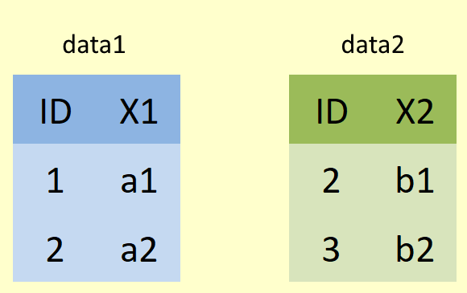
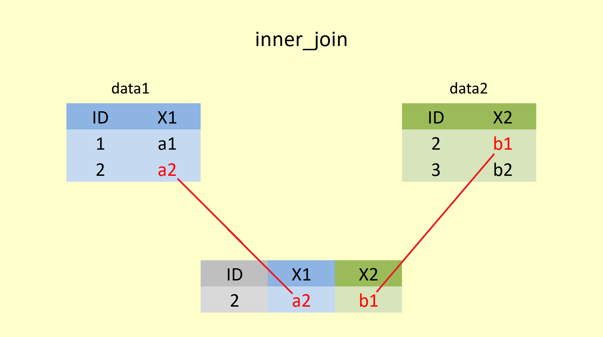
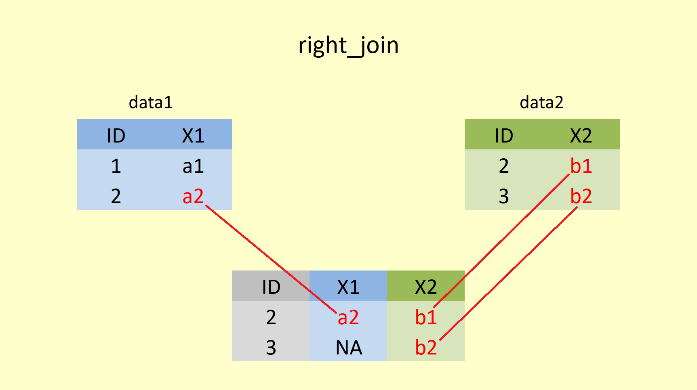

# Data Transformation 2: More One and Two Table Verbs

## Intended Learning Outcomes {-}

1. Be able to use the following dplyr one-table verbs:

* group_by()
* summarise()

2. Be able to chain functions together using the pipe operator (%>%)

3. Be able to use the following dplyr two-table verbs:

* Mutating joins: `left_join()`, `right_join()`, `full_join()`, `inner_join()`
* Binding joins: `bind_rows()`, `bind_cols()`


This lesson is led by [Kate Haining](http://www.psy.gla.ac.uk/staff/index.php?id=KH001).


##	Pre-Steps

1. Set your working directory to the `L3L4_data` folder we were working with last week and that contains the data files `Student_Mental_Health.csv` and `Anx_Emp.csv`.
2. Open the `L3L4_stub` file.
3. Load `tidyverse` into the library.
4. Read the data from `Student_Mental_Health.csv` into your `Global Environment` as `student_MH`.
5. Deselect  the columns `Region`, `Stay_Cate`, `Japanese_cate`, and `English_cate`. Store this data as an object `short_MH`.
6. Read the data from `Anx_Emp.csv` into your `Global Environment` as `extra_MH`. This data will be needed for the two-table verbs later on. `Anx_Emp.csv` contains fake data relating to 267 students in the previous data file (`short_MH`). The column `GAD7` refers to students' scores on the Generalized Anxiety Disorder 7-item (GAD-7) questionnaire and the column `Employment` outlines the students' employment status i.e. part-time, full-time or unemployed.


`r hide("Solution")`
```{r L4, message=FALSE}
library(tidyverse)
student_MH <- read_csv("Student_Mental_Health.csv")
short_MH <- select(student_MH, -Region, -Stay_Cate, -Japanese_cate, -English_cate)
extra_MH <- read_csv("Anx_Emp.csv")
```
`r unhide()`

## group_by() and summarise()

In order to compute summary statistics such as mean, median and standard deviation, use the `summarise()` function. The first argument to this function is the object `short_MH` and the subsequent argument is the new column name and what mathematical operation you want it to contain. You can add as many summary statistics in one `summarise()` function as you want; just separate them by a comma. For example, say you wanted to work out the mean total score of depression and accompanying standard deviation for the entire sample:

```{r}
short_MH_ToDep <- summarise(short_MH, mean = mean(ToDep), sd = sd(ToDep))
short_MH_ToDep
```
 

Therefore, the mean total score of depression is 8.19 with a standard deviation of 4.95. It would be interesting to break these summary statistics down into subsets for example `ToDep` for the males and females separately. This is where the `group_by()` function comes in handy. It can organise observations (rows) by variables (columns) such as `Gender`. The first argument to this function is the object you created last week (`short_MH`) and the subsequent argument is the variable you want to group by:

```{r}
short_MH_gen <- group_by(short_MH, Gender)

```

If you view the object `short_MH_gen`, it will not look any different to the original dataset (`short_MH`). However, be aware that the underlying structure has changed. In fact, you could type `glimpse(short_MH_gen)` to double check this. 

```{r}
glimpse(short_MH_gen)
```


You can now feed this grouped dataset (`short_MH_gen`) into the previous code line to obtain summary statistics by `Gender`:

```{r}
short_MH_ToDep_gen <- summarise(short_MH_gen, mean = mean(ToDep), sd = sd(ToDep))
short_MH_ToDep_gen
```
 

<span style="font-size: 22px; font-weight: bold; color: hsl(24, 100%, 50%);">Question Time</span>

What gender has the highest mean total score of depression?  `r fitb("female")`

You might also want to calculate and display the number of males and females in the dataset. This can be achieved by adding the summary function `n()` to your previous code line:

```{r}
short_MH_ToDep_gen <- summarise(short_MH_gen, n = n(), mean = mean(ToDep), sd = sd(ToDep))
short_MH_ToDep_gen
```

<span style="font-size: 22px; font-weight: bold; color: hsl(24, 100%, 50%);">Question Time</span>

How many males are in the dataset?  `r fitb("98")` <br>
How many females are in the dataset?  `r fitb("170")`

Finally, it is possible to add multiple grouping variables. For example, the following code groups `short_MH` by `Gender` and `Academic` level and then calculates the mean total score of depression (`ToDep`) for male and female graduates and undergraduates (4 groups). 

```{r}
short_MH_group <- group_by(short_MH, Gender, Academic)
short_MH_ToDep_group <- summarise(short_MH_group, mean = mean(ToDep))
short_MH_ToDep_group
```
 

<span style="font-size: 22px; font-weight: bold; color: hsl(24, 100%, 50%);">Question Time</span>

Which group appears to be most resilient to depression? `r mcq(c("female undergraduates", "male undergraduates", "female graduates", answer = "male graduates"))`

Luckily for you, the dataset does not contain any missing values, denoted `NA` in R. Missing values are always a bit of a hassle to deal with. Any computation you do that involves `NA` returns an `NA` - which translates as "you will not get a numeric result when your column contains missing values". Missing values can be removed by adding the argument `na.rm = TRUE` to calculation functions like `mean()`, `median()` or `sd()`. For example, the previous code line would read:

```{r}
short_MH_ToDep_group <- summarise(short_MH_group, mean = mean(ToDep, na.rm = TRUE))
```

```{block, type="info"}

If you need to return the data to a non-grouped form, use the `ungroup()` function.
```

```{r}
glimpse(short_MH_gen)
short_MH_gen <- ungroup(short_MH_gen)
glimpse(short_MH_gen)
```


## The pipe operator (%>%) {#pipes}

As you may have noticed, your environment pane has become increasingly cluttered. Indeed, every time you introduced a new line of code, you created a uniquely-named object (unless your original object is overwritten). This can become confusing and time-consuming. One solution is the pipe operator (`%>%`) which aims to increase efficiency and improve the readability of your code. The pipe operator (`%>%`) read as **"and then"** allows you to chain functions together, eliminating the need to create intermediary objects. There is no limit as to how many functions you can chain together in a single pipeline.

For example, in order to `select()`, `arrange()`, `group_by()` and `summarise()` the data, you used the following code lines:

```{r}
short_MH <- select(student_MH, -Region, -Stay_Cate, -Japanese_cate, -English_cate)
short_MH_arr <- arrange(short_MH, desc(Gender), desc(ToAS))
short_MH_group <- group_by(short_MH_arr, Gender, Academic)
short_MH_ToDep_group <- summarise(short_MH_group, mean = mean(ToDep))
short_MH_ToDep_group
```

However, utilisation of the pipe operator (`%>%`) can simplify this process and create only one object (`short_MH_ToDep_group2`) as shown:

```{r}
short_MH_ToDep_group2 <- student_MH %>% 
  select(-Region, -Stay_Cate, -Japanese_cate, -English_cate) %>%
  arrange(desc(Gender), desc(ToAS)) %>%
  group_by(Gender, Academic) %>%
  summarise(mean = mean(ToDep))
short_MH_ToDep_group2
```

As you can see, `short_MH_ToDep_group2` produces the same output as `short_MH_ToDep_group`. So, pipes automatically take the output from one function and feed it directly to the next function. Without pipes, you needed to insert your chosen dataset as the first argument to every function. With pipes, you are only required to specify the original dataset (i.e  `student_MH`) once at the beginning of the pipeline. You don't need the first argument of each of the functions anymore, because the pipe will know to look at the dataset from the previous step of the pipeline.


```{block, type="task"}
**Your turn**

Amend the previous pipeline `short_MH_ToDep_group2` so that

1. `Gender` and `ToAS` are arranged in ascending order.
2. Only those observations with total social connectedness scores (`ToSC`) of more than 24 are kept
3. The standard deviation of values in the `ToDep` column is calculated for males and females at each academic level 

Save this as an object called `short_MH_ToDep_group3` to your `Global Environment`.
```

`r hide("Solution")`

```{r}
short_MH_ToDep_group3 <- student_MH %>% 
  select(-Region, -Stay_Cate, -Japanese_cate, -English_cate) %>%
  arrange(Gender, ToAS) %>%
  filter(ToSC >25) %>%
  group_by(Gender, Academic) %>%
  summarise(mean = mean(ToDep), sd = sd(ToDep))
short_MH_ToDep_group3
```

`r unhide()`


```{block, type="funfact"}

Note that in the above code chunk, the data object has been on its own line in the code followed immediately by `%>%` before starting with the "functions". 

short_MH_ToDep_group2 <- student_MH %>% <br>
  select(-Region, -Stay_Cate, -Japanese_cate, -English_cate) %>% <br>
  ...

The other option would have been to put the data object as the first argument within the first function, such as 

short_MH_ToDep_group2 <- select(student_MH, -Region, -Stay_Cate, -Japanese_cate, -English_cate) %>% 
  ...

The benefit of having the data on its own is that you reorder functions easily or squeeze another one in (for example if you summarised something but forgot to group beforehand) without having to remember to "move" the data object into the first argument of the chain. 

```


## Two-Table Verbs

More often than not, data scientists collect and store their data across multiple tables. In order to effectively combine multiple tables, `dplyr` provides a selection of **two-table verbs**. Today we will focus on two categories of two-table verbs - mutating join verbs and binding join verbs. 


###	Mutating Join Verbs

Mutating join verbs combine the variables (columns) of two tables so that matching rows are together. There are 4 different types of mutating joins, namely `inner_join()`, `left_join()`, `right_join()`, and `full_join()`.

Mutating joins have the following basic syntax:

<center>  </center>

Let's investigate joins using a simple example by creating two tibbles, `data1` (shown below in blue) and `data2` (shown below in green), both with only two columns, and two rows.

<center>  </center>

Coded in R that would look like:

```{r}
data1 <- tibble(ID = 1:2,
                X1 = c("a1", "a2"))
data2 <- tibble(ID = 2:3,
                X2 = c("b1", "b2"))
```

```{block, type="info"}
For the following examples, imagine that `X1` refers to student names and `X2` relates to student grades. Let's also imagine that `X2` includes grades for students who have since dropped the course (and thus been removed from `X1`) and that `X2` is missing some students who didn't sit the exam. 
```


#### inner_join()

An inner join returns all rows from x that have a match in y, whereby x is the first (left) table and y is the second (right) table. All columns from x and y are present in the merged object. If there are multiple rows that match, all of them are returned.

<center>  </center>

Merging `data1` and `data2` by `inner_join()` would be coded in R:

```{r}
inner_join(data1, data2, by="ID")
```


Using an inner join would return only 1 row of observations because the only `ID` value matching in `data1` and `data2` is the row with `ID = 2`. However, we are still merging both tibbles together, meaning that all columns from `data1` and `data2` are kept (in our case `X1` and `X2`). In the applied example, two students (ID 3 & 4) would be dropped from the output as their `ID` is only present in one table and thus, is unsuitable for matching. The inner join is useful in this situation as it ensures that grades are only held for students who still take the course and actually sat the exam.

```{block, type="funfact"}
`inner_join(data1, data2)` would have produced the same outcome. When the `by` statement is omitted, `data1` and `data2` are joined by ALL "overlapping" variable columns (in this case `ID`). Don't believe it? Try it out in your `Console`!
```


<span style="font-size: 22px; font-weight: bold; color: hsl(24, 100%, 50%);">Question Time</span>

Let's apply an inner join to join `short_MH` with `extra_MH` (the fake data we read in during today's pre-steps). Before we do that, it might be wise to remind ourselves of the number of rows and columns we are dealing with in both datasets. 

How many rows (or observations) does `short_MH` have? `r fitb("268")` <br>
How many columns (or variables) does `short_MH` have? `r fitb("15")` <br>
How many rows (or observations) does `extra_MH` have? `r fitb("267")` <br>
How many columns (or variables) does `extra_MH` have? `r fitb("3")` <br>


Notice that:

*	Both datasets contain a common column `ID`
*	One person (`ID = 3`) is missing from the second dataset (`extra_MH`)


```{block, type="task"}
**Your turn**

Now join `short_MH` and `extra_MH` using `inner_join()`. Save your results in the `Global Environment` as an object called `MH_inner`. How many rows and columns do you think `MH_inner` should have?

```

`r hide("Solution")`
```{r}
MH_inner <- inner_join(short_MH, extra_MH, by = "ID")
glimpse(MH_inner)
```

```{block, type="solved"}
`MH_inner` has 267 rows, and 17 columns. <br>

* rows: The overlapping `ID` numbers in both dataframes are `1,2,4,5...,268` which makes for 267 values. <br>
* columns: total number of columns is 15 (from `short_MH`) + 3 (from `extra_MH`) - the column `ID` that exists in both objects.

Notice how no rows have missing values.
```
`r unhide()`


#### left_join()

A left join returns all rows from x, and all columns from x and y. Rows in the left table with no match in the right table will have missing values (`NA`) in the new columns. 


<center>  </center>

Let's try this `left_join()` function for our simple example of `data1` and `data2` in R.

```{r}
left_join(data1, data2, by="ID")
```

Here `data1` is returned in full, and for every matching `ID` number, the value from `data2` is added for `X2`. However, `data2` does not have any value for ID = 1, hence `NA` is added in `X2`. The left join is useful if you want to simply append student names to student grades, regardless of whether students sat the exam or not. Students with `NA` values in the grade column could be offered more support and guidance in the future. 

<span style="font-size: 22px; font-weight: bold; color: hsl(24, 100%, 50%);">Question Time</span>

```{block, type="task"}
**Your turn**

Combine `short_MH` and `extra_MH` using `left_join()`. Save your results in the `Global Environment` as an object called `MH_left`. How many rows and columns are you expecting for `MH_left`?
```

`r hide("Solution")`
```{r}

MH_left <- left_join(short_MH, extra_MH, by = "ID")
glimpse(MH_left)
```

```{block, type="solved"}
Remember that ID number 3 is missing from the second (right) dataset. Since the first (left) dataset is prioritised in a `left_join()` and `data1` contains `ID` number 3, it is retained in the new dataset `MH_left` and `NA` is added to `GAD7` and `Employment`.
```
`r unhide()`


#### right_join()

A right join returns all rows from y, and all columns from x and y, whereby y is the second (right table) and x is the first (left) table. Rows in the second table with no match in the first table will have `NA` values in the new columns.

<center>  </center>

However, code-wise, you would still enter x as the first, and y as the second argument within `right_join()`.

```{r}
right_join(data1, data2, by = "ID")
```

Here `data2` is returned in full, and for every matching `ID` number, the value from `data1` is added for `X1`. As `data1` does not have any value for ID = 3, `NA` is added in column `X1` . Notice the order of the columns, though!!! `ID`, `X1` and `X2`. That is due to the order of how they are entered into the `right_join()` function. That means for our student example: The right join is useful if you want to append student grades to student names, regardless of whether students dropped the course or not. In order to measure the difficulty level of your exam, you may want to calculate the average performance of all students - even those that have since dropped the course. 


<span style="font-size: 22px; font-weight: bold; color: hsl(24, 100%, 50%);">Question Time</span>

```{block, type="task"}
**Your turn**

combine `short_MH` and `extra_MH` using `right_join()`. Save your results in the `Global Environment` as an object called `MH_right`. How many rows and columns should `MH_right` have?
```

`r hide("Solution")`
```{r}
MH_right <- right_join(short_MH, extra_MH, by = "ID")
glimpse(MH_right)
```

```{block, type="solved"}
We should receive 267 observations and 17 columns. Since the second (right) table is prioritised and does not contain ID number 3, it is absent from the new dataset. In this case, `right_join()` produces the same output as `inner_join()`. 
```
`r unhide()`


#### full_join()

A full join returns all rows and all columns from both x and y, whereby x is the first (left) table and y is the second (right) table. `NA` values fill unmatched rows. 

<center>  </center>


```{r}
full_join(data1, data2)
```

As you can see, `ID` values (1,2, and 3) from both dataframes are retained. ID = 3 does not exist in `data1`, and ID = 1 does not exist in `data2`, `X1` and `X2` are filled with `NA` respectively. Since the full join is the combination of both left join and right join, it would contain all student names, regardless of whether students dropped the course or not, and all student grades regardless of whether students sat the exam or not. Thus, it can be used to tailor student support and guidance and measure the difficulty level of the exam. 


<span style="font-size: 22px; font-weight: bold; color: hsl(24, 100%, 50%);">Question Time</span>

```{block, type="task"}
**Your turn**

combine `short_MH` and `extra_MH` using `full_join()`. Save your results in the `Global Environment` as an object called `MH_full`. How many rows and columns are you expecting for `MH_right`?
```

`r hide("Solution")`
```{r}
MH_full <- full_join(short_MH, extra_MH, by = "ID")
glimpse(MH_full)
```

```{block, type="solved"}
We should receive 268 observations and 17 columns. All data is kept, including ID = 3, and `GAD7` and `Employment` are filled up with `NA` values. In this case, `full_join()` produces the same output as `left_join()`. 
```
`r unhide()`


```{block, type="question"}
**Hypothetical scenario**

In the case of the student mental health data, we have seen that `inner_join()` and `right_join()` as well as `left(join)` and `full_join()` produce the same results. Can you think of a way how you would have to modify `short_MH` and/or `extra_MH` to produce different results for `inner_join()`/ `right_join()` or `left(join)`/`full_join()`?
```

`r hide("Solution")`
```{block, type="solved"}
Adding data for participant 269 to `short_MH` and 270 to `extra_MH` would do the trick:

* `inner_join()` would still be the same output of 267 observations since the "overlapping" `ID` numbers for `data1` and `data2` don't change (1,2,4,5,...,268) <br>
* `right_join()` would prioritise the right table `extra_MH`, leaving us with `ID` numbers 1,2,4,5,...,268,270 (adding to a total of 268 observations. For ID = 270, `X1` would be filled with `NA`; ID = 3 would not be mentioned. <br>
* `left(join)` would prioritise the left table `short_MH`, selecting `ID` rows 1:269. For ID = 3 and ID = 269 `X2` would show `NA`. ID = 270 would not be mentioned. <br>
* `full_join()` would add both datasets in full, showing `ID` values 1:270, with ID = 270 showing `NA` for `X1`, and ID = 3 and ID = 269 showing `NA` for `X2`.
```
`r unhide()`


```{block, type="info"}
All visualisation for the joins were adapted from  https://statisticsglobe.com/r-dplyr-join-inner-left-right-full-semi-anti. The website also provides additional information on filtering joins (semi and anti joins) that we haven't touched upon.
```


###	Binding Join Verbs

In contrast to mutating join verbs, binding join verbs simply combine tables without any need for matching. Dplyr provides `bind_rows()` and `bind_cols()` for combining tables by row and column respectively. When row binding, missing columns are replaced by `NA` values. When column binding, if the tables do not match by appropriate dimensions, an error will result. 

Let's take our simple example from above and see how `data1` and `data2` would be merged with `bind_rows()` and `bind_cols()`.


```{r}
bind_rows(data1, data2)
```

`bind_rows()` takes `data2` and puts it underneath `data1`. Notice that the binding does not "care" that we have now two rows representing ID = 2. Since `X1` and `X2` do not exist in `data1` and `data2` respectively, `NA` are added.


```{r}
bind_cols(data1, data2)
```

`bind_cols()` takes `data2` and puts it right next to `data1`. Since the column name `ID` has already been taken, column 3 gets called `ID1`.

In the case when the dimension between the dataframes do not match, `bind_rows()` would still work, whereas `bind_cols()` would produce an error message.

```{r}
data3 <- tibble(ID = 3:5,
                X3 = c("c1", "c2", "c3"))

bind_rows(data1, data2, data3)
```

```{r eval=FALSE}
bind_cols(data1, data3)
```

<center>  </center>

```{block, type="funfact"}
By the way, you can merge as many data objects as you like with the binding functions, whereas in the join functions, you are limited to two. However, you could use a pipe to combine the merged dataframe with a third.

example 1: bind_rows(data1, data2, data3) <br>
example 2: full_join(data1, data2) %>% full_join(data3)
```


```{block, type="task"}
**Your turn**

You have finally found the missing data corresponding to `ID` number 3. This subject has a GAD7 score of 4 and is employed part-time. Store this information in a tibble called `new_participant` and bind it to the `extra_MH` dataset using `bind_rows()`. Store this merged output to your `Global Environment` as a new object called `extra_MH_final`. 
```

`r hide("Solution")`
```{r}
new_participant <- tibble(ID = 3,
                          GAD7 = 4,
                          Employment = "Part")
extra_MH_final <- bind_rows(new_participant, extra_MH)
```
`r unhide()`

```{block, type="task"}
**Follow-up Question**

The dataset `extra_MH_final` now contains the same number of observations (rows) as `short_MH`. Use `bind_cols()` to merge these two datasets together in a tibble called `MH_final`. How many rows and columns are you expecting for `MH_final` to have and why?
```

Rows (or observations): `r fitb("268")` <br>
Columns (or variables): `r fitb("18")` <br>

`r hide("Solution")`
```{r}
MH_final <- bind_cols(short_MH, extra_MH_final)
```

```{block, type="solved"}
We were expecting 268 observations (as both datasets have 268 rows) and 18 columns (i.e. 15 from `short_MH` and 3 from `extra_MH_final`). Notice that the `ID` column has been duplicated with an added suffix. 
```

```{block, type="task"}
**Follow-up Question 2**

Using your knowledge of one-table verbs, exclude the column `ID1`, overwriting the object `MH_final`.
```

`r hide("Solution")`
```{r}
MH_final <- select(MH_final, -ID1)
```

```{block, type="task"}
**Follow-up Question 3**

Rather than using `bind_cols()` and `select()`, can you think of a different way how you could have merged `short_MH` and `extra_MH_final`?
```


`r hide("Solution")`
```{r}
# One solution:
MH_final <- full_join(short_MH, extra_MH_final)
```

```{block, type="solved"}
Actually, any of the other joins would have worked as well, though `right_join()` would have sorted the column `ID` differently. Try it out!
```
`r unhide()`
`r unhide()`
`r unhide()`

## Additional information

Garrick Aden-Buie created some amazing gganimation gif to illustrate how the joins work. Check it out! https://www.garrickadenbuie.com/project/tidyexplain/


## Summative Homework

The second summative assignment is available on moodle now.

Good luck.

Check that your Rmd file knits into a html file before submitting. Upload your Rmd file (not the knitted html) to moodle. 