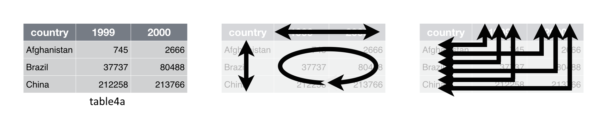
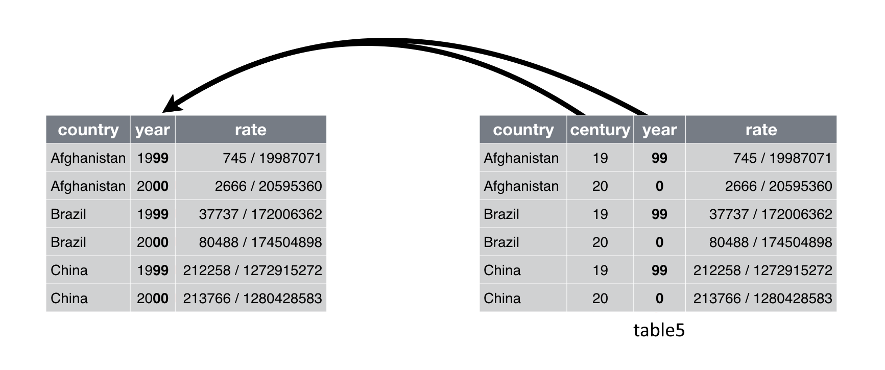

# Data Transformation 3: Tidy Data

## Intended Learning Outcomes {-}

The whole purpose of the next two lecture is to tidy up dataframe and expose you to a bunch of useful functions that would make your daily life easier when dealing with your own data. By the end of today, you will know

1. How to rearrange data from long format into to wide format and vice versa
2. How to combine and separate columns

This lesson is led by [Gaby Mahrholz](http://www.psy.gla.ac.uk/staff/index.php?id=GM005).

## Pre-steps

All the functions for tidying data are within `tidyverse` so we need to make sure to load it into the library. Today's lecture will make use of built-in dataframes which means we do not have to load any data into our `Global Environment` for the minute.

```{r L5, message=FALSE}
library(tidyverse)
```


## Tidy data

*"Happy families are all alike; every unhappy family is unhappy in its own way."* -- Leo Tolstoy

*"Tidy datasets are all alike, but every messy dataset is messy in its own way."* -- Hadley Wickham


In this chapter, you will learn a consistent way to organise your data in R. Hadley Wickham and Garrett Grolemund call this **tidy data**. In most cases, data does not come in a tidy format. Researchers spend most of their time getting the data into the shape it needs to be for a particular analysis. The tools we introduce you to this week and next should form the basics for data wrangling. The idea is that tidy datasets are easier to work with in the long run.

There are three interrelated rules which make a dataset tidy:

1. Each variable must have its own column.
2. Each observation must have its own row.
3. Each value must have its own cell.


If you want to know more about tidy data, Hadley Wickham's paper can be found on https://vita.had.co.nz/papers/tidy-data.pdf or check out chapter 12 in the book R for Data Science (https://r4ds.had.co.nz/tidy-data.html).


## gather() and spread()

`gather()` and `spread()` are part of `tidyr` (also part of the tidyverse package) and help you to rearrange the shape of your data. To get your data into long format, you would use `gather()`; if you wanted to get your data from long to wide format, you would need `spread()`. Here is a nice gif animation by Garrick Aden-Buie (https://www.garrickadenbuie.com/project/tidyexplain/#spread-and-gather) that shows you how `gather()` and `spread()` work.

<center>  </center>


### gather()
We can start this lecture by looking at a practical example in the build-in dataset `table1` to `table5`. They show the number of Tuberculosis cases documented by the World Health Organization in Afghanistan, Brazil, and China between 1999 and 2000 (the full dataset is called `who`). The data is part of the `tidyverse` package, so as long as we have `tidyverse` loaded into the library, there should not be an issue in accessing this dataset.


```{r}
table1
```

`table1` has a very tidy structure as it follows the three principles above - each variable is its own column, each observation is its own row, and each value is its own cell. 

<center>  </center>

You can see the data contains values associated with four variables (`country`, `year`, `cases`, and `population`). `table4a` however, looks a touch not right.

```{r}
table4a
```

<center>  </center>

Somehow the values for the columns `year` and `cases` are missing and instead we find two separate columns for `1999` and `2000` that have all `cases` values listed. This is a problem as `1999` and `2000` are actual values and not variables. What we want to do, is gather `1999` and `2000` in one column `year` and respective values into a second column called `cases`.


<center>  </center>


Currently the data is in what is called a `wide format`. The function `gather()` comes in handy when we want to get the data into the shape of a `long format` like in `table1`. `gather()` is structured like:

<br>

<center>  </center>

<br>


Let's apply this formula to `table4a`

* We need a dataframe that we want to modify -> `table4a` 
* We need to come up with the name of a new column in which the values of 1999 and 2000 will be stored -> `year`
* We need to come up with the name of a new column in which all the case values will be stored -> `cases`
* And finally, we need to tell R which columns in `table4a` we want to turn into long format (i.e. the columns of the 7 subscales) -> 1999 and 2000 (Note that "1999" and "2000" are non-syntactic names as they don't start with a letter. The solution is to surround them in backticks.)


```{r}
gather(table4a, key = year, value = cases, `1999`:`2000`)
```

```{block, type="funfact"}
Here we have only 2 columns to reshape `1999` and `2000`. We could have written ``gather(table4a, year, cases, \`1999\`, \`2000\`)``.
```

```{block, type="task"}
**Your turn**

Look at `table4b`. There are two separate columns `1999` and `2000` with population values for Afghanistan, Brazil, and China. Use the `gather()` function on `table4b` to reshape it from wide format into long format.
```

`r hide("Solution")`
```{r}
gather(table4b, key = year, value = population, `1999`:`2000`)
```
`r unhide()`


### spread()


Now onto the reverse. `spread()` will spread the data from `long` into `wide format`. When you have observations that are scattered across multiple rows, you can use `spread()` to split those rows up into separate variables. Let's take a look at `table2`.

```{r}
table2
```


<center>  </center>

`table2` has the variables `cases` and `population` stored in one column `type` and their respective values in `count`. However, `cases` and `population` are separate variables rather than values of `type`. So best to get them spread out into their own columns as shown in the image below.


<center>  </center>


Take a look how `spread()` achieves that.

<br>

<center>  </center>

<br>

Let's apply the formula above to `table2`:

* We need a dataframe that we want to modify -> `table2` 
* We need to decide which of the columns in `table2` will become the new column headers -> `type`
* We need to decide which of the columns in `table2` has all the data in it that will become the new cell values -> `count`


```{r}
spread(table2, key = type, value = count)
```

Voila, `cases` and `population` are in their own columns.

Let me modify `table1` a tiny bit.

```{r}
table1_mod <- table1 %>% 
  mutate(percent = cases/ population * 100) %>% 
  gather(variable, values, cases:percent)
```


```{r, echo=FALSE}
kable(table1_mod)
```


```{block, type="task"}
**Your turn**

In the modified table above `table1_mod`, we added a `percent` column to see how much percentage of the population had Tuberculosis in 1999 and 2000 in each of the countries Afghanistan, Brazil, and China. But somehow, all numerical information has ended up in 1 column (values).

Your task is to spread the data back out, so that cases, population, and percentage values are in their own columns, titled as `cases`, `population`, and `percent` respectively. Store the new object in the `Global Environment` as `table1_mod_corrected`. When you are done, `table1_mod_corrected` should look like this...

```

```{r, echo=FALSE}
kable(spread(table1_mod, key = variable, value = values))
```


`r hide("Solution")`
```{r}
table1_mod_corrected <- spread(table1_mod, key = variable, value = values)
```

`r unhide()`


## separate() and unite()

`separate()` turns a single character column into multiple columns, whereas `unite()` combines the values of multiple columns into one column.

### separate()

Take a look at `table3`. 


```{r}
table3
```

In `table3`, two out of three principles of tidy data are violated. There are multiple values stored in column `rate` (rule 3) but these multiple values also belong to two different variables - `cases` and `population` respectively (rule 1).

<center>  </center>


Here, we would use `separate()` to split the column `rate` into two columns `cases` and `population`. 

<center>  </center>

The function `separate()` is structured like this:

<br>

<center>  </center>

<br>

We would need

* the data in which the column to separate is located -> `table3`,
* the actual column we want to separate -> `rate`,
* the into argument asking into how many columns we want to separate the old column and what we want to call these new columns -> `c("cases", "population")`, and
* a separator argument -> `"/"`.


```{r}
separate(table3, rate, into = c("cases", "population"), sep = "/")
```

R has put all cell information before the `/` into a column we named `cases`, and everything after the `/` into the column we decided to call `population`. `/` will not appear in either column `cases` or `population`. The data is now in a tidy format.

```{block, type="info"}
By the way, the separator argument `sep = ` can be any non-alphanumeric character, for example:

* underscore ("_"), 
* comma (","), 
* semi-colon (";"),
* colon (":"),
* forward-slash ("/"),
* space (" ") or 
* nothing ("").

But watch out! When the separator is a `full stop`, you would need to add a double backward slash in front of it (``sep = "\\\\."``).
```

### additional arguments for separate()

#### Retaining the original column

If for some reason, you wanted to keep the original column, you can set an additional argument `remove` to `FALSE`.

```{r}
separate(table3, rate, into = c("cases", "population"), sep = "/", remove = FALSE)
```

#### Dropping parts of the original column

What if we were just interested retaining part of the data in the cell, for example keeping the column `cases` but not `population`. The solution would be to work with an `NA` argument. Defining the new columns as `cases` and `NA` will keep everything before the separator in the column `cases`, and drops everything after the separator.

```{r}
separate(table3, rate, into = c("cases", NA), sep = "/")
```

```{block, type="task"}
**Your turn**

Separate the column `rate` in `table3` to keep only the values after the separator in a column called `population`. Drop the values in front of the separator. Retain the column `rate` as well.
```


`r hide("Solution")`
```{r}
separate(table3, rate, into = c(NA, "population"), sep = "/", remove = FALSE)
```
`r unhide()`


#### Separating by position

It is also possible to separate by position. `sep = 2` would split the column between the second and third character/ number etc.

Let's try that the separation by position. We will keep 4 letters from each `country` name rather than the whole word, and drop the rest.

```{r}
separate(table3, country, into = c("country", NA), sep = 4)
```


#### Separating into more than 2 columns

Special case. Let's modify `table3` a little bit by adding a new column with a value of 200 and unite that column with column `rate`.

```{r}
table3_mod <- table3 %>% 
  mutate(new = 200) %>% 
  unite(rate, rate, new, sep = "/")
```

Now column `rate` has 3 sets of numbers, separated by two `/`. If we define we want to split the data into 2 columns, the first 2 sets of numbers are kept, and the third one is dropped with a warning. The code is still executed but the warning indicates that it might not have gone as planned. Hence, it is always good to check that the data object in the `Global Environment` looks exactly as what you have intended.

```{r}
separate(table3_mod, rate, into = c("cases", "population"), sep = "/")
```

If we are separating the columns and wanted to keep all sets of numbers, one in each column, we would use an into argument that includes 3 new columns.

```{r}
separate(table3_mod, rate, into = c("cases", "population", "200"), sep = "/")
```

```{block, type="funfact"}
Technically, you would not need a separator argument in the case above, as `separate()` splits the data whenever it detects a non-alphanumeric character (i.e. a character that isn't a number or letter). Saying that, the separator argument is needed when your column contains non-alphanumeric characters as part of your cell values.
```

If the values in `population` and `200` (separated by a `/`) were some sort of `ID_code`, **AND** we wanted to split the data into 2 columns, after the first `/` only, we would have to include an `extra` argument, and set it to `"merge"`.

```{r}
separate(table3_mod, rate, into = c("cases", "ID_code"), sep = "/", extra = "merge")
```


```{block, type="question"}
There is still a tiny bit off in the `tb_cases`. Can you spot what it is? * Hint: Think about if you wanted to sum up all the TB cases occurred in the 3 countries within the years 1999, and 2000.
```


`r hide("Solution")`
```{block, type="solved"}
The new columns `ID_code` and `cases` are `character` columns. Whilst this is fine for `ID_code`, it is less beneficial for `cases.` If we wanted to sum up the cases column, values would need to be `numerical`. We could use the converting function `as.integer()`.
```

```{r}
table3_mod %>% 
  separate(rate, into = c("cases", "ID_code"), sep = "/", extra = "merge") %>% 
  mutate(cases = as.integer(cases))
```

`r unhide()`

#### Converting data types

The slightly quicker and perhaps more elegant solution would be to add another argument `convert` to `separate()` and set it to `TRUE`. This will convert `cases` to `integer` and leave `ID_code` as `character` due to the non-numerical `/`.

```{r}
table3_mod %>% 
  separate(rate, into = c("cases", "ID_code"), sep = "/", extra = "merge", convert = TRUE)
```


### unite()

Take a look at `table5`. 

```{r}
table5
```


Here the values in column `year` are split into `century` and `year` which is not very useful. Best to merge the 2 columns together as shown in the image below.

<center>  </center>


`unite()` (the inverse of separate) can help to combine the values of `century` and `year` into a single column. It is used less frequently than it's counterpart, but is still a useful function to know.

The function `unite()` is structured like this:

<br>

<center>  </center>

<br>


We would need the data `table5`, a new column we want to create `year`, the two columns we would like to combine (`century` and `year`), and define the separator as "nothing" since the default is sep = "_".

```{r}
unite(table5, year, century, year, sep = "")
```

Yay! The data of `table5` is in a tidier format now - at least for column `year`. Ah, but we didn't save the changes as an object in our `Global Environment`.


```{block, type="task"}
**Your turn**

Let's combine the two steps of tidying `table5` in a single pipe `%>%` - separate the `rate` column into `cases` and `population`, and unite the columns `year` and `century` into a new column `year`. Store the new object as `tb_cases` in the `Global Environment`. Make sure, the columns `cases` and `population` are `integer` values.
```

`r hide("Solution")`
```{r}
tb_cases <- table5 %>% 
  separate(rate, into = c("cases", "population"), sep = "/", convert = TRUE) %>% 
  unite(year, century, year, sep = "")
tb_cases
```
`r unhide()`


```{block, type="info"}
The year column is still a `character` column. In this case, it does not matter too much, as 1999 and 2000 are levels of the column `year` and very unlikely to be involved in any calculations. In case we are dealing with actual numerical value and have the need to convert the data type, we need to use the function `as.integer()` as unite does not have a `convert` argument available.
```

```{r}
tb_cases_converted <- tb_cases %>% 
  mutate(year = as.integer(year))
tb_cases_converted
```


### additional arguments for unite()

#### Retaining the original column

Similarly to `separate()`, unite also comes with a remove statement, so if you wanted to keep the original columns before merging them together, you would code

```{r}
unite(table5, year_combined, century, year, sep = "", remove = FALSE)
```

#### Removing missing values before uniting columns

`unite()` also comes with an `na.rm` statement that will remove missing values prior to uniting the values of a column (actually, the values have to be a "character" column). Let me modify `table5` a wee bit to make that point.

```{r}
table5_mod <- table5 %>% 
  mutate(new = rep(c("200", NA), 3))

table5_mod
```

If we wanted to combine the values of `rate` and `new`, we would code

```{r}
unite(table5_mod, rate, rate, new, sep = "/")
```

See how R adds the missing values onto rate, which we do not want. To avoid that happening, we can use the `na.rm` statement which removes missing values in columns of data type character before merging the columns.

```{r}
unite(table5_mod, rate, rate, new, sep = "/", na.rm = TRUE)
```


## Bonus materials: mutate row names from the mtcars

Remember, in lecture 2 when we were talking about the mtcars dataset and how the car types were not in listed as a separate column but rather row names? Let's just read in the data and have another quick look to jog our memories...

```{r}
df_mtcars <- mtcars

head(df_mtcars)
```

You can see much better what I'm talking about when you view your `df_mtcars`.


Now, that we have learnt about the `mutate()` function, we can attempt to get all of these row names into a new column. All we have to do is combining a function called `rownames()` with `mutate()`. We also could use some more of these handy pipes `%>%` you learnt about last week.

```{r}
df_mtcars <- mtcars %>% 
  mutate(Car_type = rownames(mtcars))
```

In this example, we have taken the dataset `mtcars`, then added a new column called `Car_type` with `mutate()`. The column `Car_type` should then hold all the values that were previously listed as the row names in the original `mtcars` data.

```{r}
head(df_mtcars)
```


```{block, type="question"}
We can now look at the data `df_mtcars`, and see that the new column was added at the end of the dataset. What would we have to do to make `Car_type` the first column in the dataframe?
```

`r hide("Answer")`
```{r}
# We could use the fuction select()
df_mtcars <- mtcars %>% 
  mutate(Car_type = rownames(mtcars)) %>% 
  select(Car_type, mpg:carb)

head(df_mtcars)
```
`r unhide()`


## Additional information

More information on stuff we covered today and beyond can be found here:

* https://r4ds.had.co.nz "R 4 Data Science" by Garrett Grolemund and Hadley Wickham is the official guidebook for R
* https://suzan.rbind.io/categories/tutorial/ She has some pretty cool tutorials on data wrangling


## Formative Homework

The formative assessment can now be downloaded from moodle. There is no need to submit your answers to moodle.
