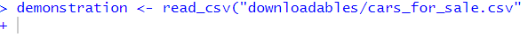
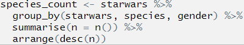
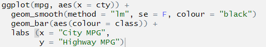
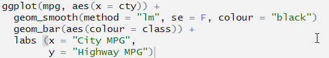
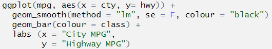

# Errors

## Intended Learning Outcomes {-}

By the end of this session you should be:

1. Able to *identify some of the more common errors found in R code*.
2. Able to *correct some of the more common errors found in R code*.
3. Know where to go online *to find help and continue your coding journey on your own*.

This lesson is led by [Rebecca Lai](http://www.psy.gla.ac.uk/staff/index.php?id=RL003).

## Errors: How to avoid some and live through the rest

I don't know a single person who can produce 100% correct code on the first attempt. It's even common to produce code that runs, only for you to find out later that there were errors. Not all errors prevent code from running!

This is a lesson focused on how to find and correct it *when* they happen- and they often do.

## Debugging

<center> <figure><figcaption>A literal bug in a machine, often incorrectly cited as the source of the term "debugging". From https://en.wikipedia.org/wiki/Debugging. </figcaption></figure> </center> <br>

Debugging is the process of identifying and removing errors from your code. It sounds a bit technical, but you've probably been doing it already.

What you do to identify errors depends on what is wrong. There are various types of messages that R will give you that will help you identify the issues that you are having.

Reading these error messages will come naturally after you get a bit more experience under your belt, but in the meantime let's look at common problems.

### Messages from R

Occasionally, R will return some text when you run a piece of code. Often, this text is coloured red, which causes a bit of panic in newer users. It is printed in the console, but also may be displayed below code chunks in R Markdown documents.

``` {block, type = "info"} 
It is important to note that **not all red text indicates an error!** There are a number of things that R could be trying to tell you, all that the red colour indicates is that you should be paying attention to it.
```

Let's have a look at what different types of thing R could be telling you when you get a text output.

### Error Messages

These are definitely the ones that people worry about the most, but error messages given information about what has gone wrong. By reading and interpreting these messages we can diagnose the problem and fix it- a process called **debugging**. Let's do something that will definitely generate an error and have a look at it:

```{r error=TRUE}
demo <- read_cvs("some_file_name.csv")
```

Breaking it down:

- `Error...`: error messages are always preceded by the word error
- `could not find function "read_cvs"`: the content of the error message. In this case the function I have tried to call is not found. 

``` {block, type = "info"}
**Error messages should give a hint as to what has gone wrong**. You will gain more experience in reading and interpreting these messages over time, most of us have just seen them a lot in our own work and have become accustomed to it!
```

Trying to run a piece of code that results in an error will not produce any output, besides the error message. This means that any objects you try to create or processes that you try to run, will not be created or run.

```{block, type = "warning"}

**It is possible to write code which is valid, but does not do what you expect it to do!** In this case, no error messages are produced, but the final outcome is still "incorrect"- that is, it is not the outcome that you anticipated.

For this reason, you should always check that the outcome you have gotten from a line or segment of code is what you expected to get!

For example, this might happen if you try to use `filter(variable > 150)`, which would retain all observations where the values in `variable` were greater than 150, when you actually mean to use `filter(variable < 150)` to get rid of all observations where the values in `variable` were greater than 150 (retaining those below 150).
```

<span style="font-size: 22px; font-weight: bold; color: hsl(24, 100%, 50%);">Question Time</span>

```{block, type="task"}

**Your turn**

We have some error messages below- let's look at them and see if we can solve them.

If you want, you can download <a href="data/cars_for_sale.csv" download>cars_for_sale.csv</a> and test them out as we go.

```

#### Could not find function: 1 {-}

```{r error=TRUE}
demonstration <- read_cvs("cars_for_sale.csv")
```

What do you think this error message means? How is it fixed?

`r hide("Solution")`
```{r, eval = F}
demonstration <- read_csv("cars_for_sale.csv")

# We tried to run the function read_cvs()- this doesn't 
# exist! Again, it might seem trivial, but R really 
# wont know what this means.
```
`r unhide()`

#### Could not find function: 2 {-}

```{r eval = F}
demonstration <- read_csv("cars_for_sale.csv")
```

```{r}
## Error in read_cvs("cars_for_sale.csv"): could not find function "read_csv"
```

What do you think this error message means? How is it fixed?

`r hide("Solution")`
```{r, eval = F}
demonstration <- read_csv("cars_for_sale.csv")

# We tried to run the function read_csv(), but if tidyverse
# is not loaded then this function, which is part of tidyverse,
# is not available for use.

# We need to run library(tidyverse) before we can use it
```
`r unhide()`

#### Unexpected ')' {-}

```{r error=TRUE, echo=TRUE}
library(tidyverse))
```

What does the error message tell you? What happened and what do you think I should do to fix it?

`r hide("Solution")`
```{r, eval = F}
library(tidyverse)

# There was an extra ) in there. It might seem trivial, 
# but this prevented the line of code from being run.

# This can happen with any function that uses brackets, 
# but also with other symbols such as ",".
```
`r unhide()`

#### Not in current working directory {-}

```{r error=TRUE}
demonstration <- read_csv("cars_for_sale.csv")
```

What do you think this error means? We have all seen it at least once. I see it all the time because I always forget to do something when I start working.

`r hide("Solution")`

If you are coding along and have correctly set your working directory before trying to replicate this error... you won't see the error! Well done!

```{r, eval = F}
demonstration <- read_csv("cars_for_sale.csv")

# We tried to run the function read_csv() and to read
# cars_for_sale.csv, but in this instance the file was 
# not in the current working directory

# to fix this we can go to the Session Menu, Set Working
# Directory and Choose Directory to tell R where this file
# can be found
```
`r unhide()`

#### Could not find object {-}

```{r error=TRUE}
head(demonstration)
```

I've tried to use the function head on the object I tried to create above. Have a think about why this error has been returned and how to fix it. 

`r hide("Solution")`
```{r, eval = F}
head(demonstration)

# This code is correct, but errors can be cumulative... 
# that is, if a later piece of code is contingent on a 
# previous piece of code running successfully then
# the later piece of code won't work if the earlier
# one wasn't run!

# The previous code creating the object had many errors, 
# one loading tidyverse into the library which is 
# necessary for the `read_csv()` function to be usable 
# and the second was a typo in the `read_csv()` function, 
# so the object `demonstration` was not created, and 
# thus there is no object to call using `head()`
```
`r unhide()`

#### Code won't run, + in the console {-}

```{r eval=FALSE}
demonstration <- read_csv("cars_for_sale.csv"
```

This error appears in the console as below:

<center></center>

What has happened? How do I fix it?

`r hide("Solution")`
```{r, eval = T, error = T}
demonstration <- read_csv("cars_for_sale.csv")

# This time there is a missing bracket at the end!

# This means R is still expecting some kind of input.
# It's kinda like talking to someone but forgetting to 
# finish the sentence! The person listening will be
# confused because they expected a bit more.

# To get rid of the +, click in the console then 
# press the escape key ("esc", top-left of the keyboard)
# until you see the more familiar > symbol.

# Next, correct the code by giving R what it expected 
# you to finish with, in this case the closing ).
# Run the code again to create the object.
```
`r unhide()`

### Multiple Errors

If you have an error in your script on an earlier line, and have code later which depends on the success of running this earlier line, then you are also going have problems. Later code which might otherwise work would be missing a key component which would cause errors further down.

Sometimes finding the source of an error requires you to go back to look through your previous code. Keep this in mind when debugging!

For example: `libraary(tidyverse)` fails to load the appropriate package containing the function we need (`read_csv()`), which then means we do not load the data file we want.

You can help prevent this sort of thing from happening by running all lines of code individually, rerunning later code after you've made changes to earlier code and periodically restarting the R session and running all code from the beginning. 

Find the error location by following the trail set out in the error message. Where did the code stop running correctly? When did the error message appear in the console or in the .Rmd outputs? What does the error message say? 

These pieces of information should allow you to find the location of the error and solve it successfully.

### Finding errors in longer code segments

The above examples are the most simple examples of debugging that you are likely to get. If these are the only ones you encounter, you will be incredibly lucky!

We've been learning to use longer segments of code- not only single lines as in the example above... this can make it more difficult to find and diagnose errors.

Let's look at some error messages in longer examples and discuss some of the strategies that you might want to use to make your life easier.

#### Errors in Pipes

As we saw before, pipes allow us to chain multiple functions together. For a recap of pipes, see the section on pipes in [lecture 4](#pipes). This makes life a lot easier, *if the code works*. If there is an error, it makes debugging a little more difficult as we need to establish which line the error occurs in.

Let's get a working example going, and we'll use some of the data built in to the tidyverse called `starwars` so we don't need to import any new data. let's look at it:

```{r}
library(tidyverse)

head(starwars)
```

This is the data on the characters in the Star Wars universe (I have no idea if it counts the newer movies).

Let's look at this (faulty) code which counts the number of each species and their genders featured then arranges them by number in descending order:

```{r error=T}
species_count <- starwars %>%
  group_by(starwars, species, gender) %>%
  summarise(n = n()) %>%
  arrange(desc(n))
```

What is the best way to find out which part is wrong?

Going through it a bit at a time will help you!

We can do this by first highlighting the first line _**before the first pipe**_ and then pressing `Ctrl`+`Enter`. this will run only that line of code:

<center></center>

OK, we can see that we now have an object called `species_count` in the environment, and this now contains the data set `starwars`. The code ran, and ran as we expected it to.

Let's move on to the second line. Highlight the first two lines _**before the second pipe**_, again this will only run the first two lines of code:

<center></center>

```{r echo = F, error = T}
species_count <- starwars %>%
  group_by(starwars, species, gender)
```

There we go, the location of the error is uncovered! We can now look at what is going on in line 2 and figure out what is going on.

<span style="font-size: 22px; font-weight: bold; color: hsl(24, 100%, 50%);">Question Time</span>

From the text of the error message that the error relates to the column name `starwars`, so we look at parts called `starwars` in our code. We have already established that the first time this appears (in line 1) that the code runs and runs as we expected it to, so the error is in line 2. 

Let's look at line 2 in more detail. We know that:

* the result of line 1 (the entire data frame `starwars`) is run **and then** is put into the first argument of the second line's function
* `group_by()` normally takes a data frame as its first argument so we only need to specify the grouping variables because the data argument is already specified by the pipe.

Given the information above and the text of the error message, who knows what is happening? What would the correct code be?

`r hide("Solution")`

We tried to re-specify the data frame argument in the `group_by()` function on the second line.

Because the pipe operator already does this, the function then interprets the extra `starwars` as a column to group by. There is no column called that in the data frame, so we get an error message saying that there is no column called `starwars`.

```{r echo = F, error = T}
species_count <- starwars %>%
  group_by(starwars, species, gender)
```

This would be the correct code to use:

```{r, eval = T, error = T}
species_count <- starwars %>%
  group_by(species, gender) %>%
  summarise(n = n()) %>%
  arrange(desc(n))
```

This is a common error for those who are new to using pipelines in their code.

`r unhide()`

#### Errors in ggplot()

`ggplot()` errors can be difficult to diagnose for the same reason that pipeline errors can be- there are multiple lines of code!

Let's get an example of a plot to work with. We'll use the built in data set called `mpg`.

The following plot looks at data on fuel consumption. More specifically it shows the relationship between city fuel consumption (on the x axis) and highway fuel consumption (on the y axis), with a "line of best fit" to demonstrate the correlation between them. Vehicles of different classes are specified in different colours according to the legend on the right of the graph.

```{r echo = F}
ggplot(mpg, aes(x = cty, y= hwy)) +
  geom_smooth(method = "lm", se = F, colour = "black") +
  geom_point(aes(colour = class)) +
  labs (x = "City MPG",
        y = "Highway MPG")
```

Plots are made by code, and like all the other code, it can be subject to the same errors from misplaced or missing brackets, commas and non-existent objects in the environment. We won't be looking at these here because they've been covered above and you should be able to extrapolate that information when the same error occurs under different circumstances. 

Let's look at a few errors that can occur specifically when creating plots:

```{r error = T, eval = F}
ggplot(mpg, aes(x = cty)) +
  geom_smooth(method = "lm", se = F, colour = "black") 
  geom_bar(aes(colour = class)) +
  labs (x = "City MPG",
        y = "Highway MPG")
```

Here is the code to recreate the graph presented above, but I've created 3 errors in it. These are probably the most common errors you will encounter. 

<span style="font-size: 22px; font-weight: bold; color: hsl(24, 100%, 50%);">Question Time</span>

Let's look at fixing these 3 errors. As a bonus, the same method used in debugging pipes is also used.

The data set `mpg` is built in to tidyverse, so if you want to code and test the issues to see if you resolve them please do.

##### stat_smooth requires the following missing aesthetics: y {-}

This is our first attempt at replicating the graph above. This time we have three errors, two with error messages (currently), but let's focus only on the first one for now. The error message that appears first in the console is the one that happens first in the code and **error messages can be cumulative**- even if we correct the second one it still might not work because of the earlier code.

When I run this code, I get the following print out in the console, indicating the errors that have occurred:

```{r error = T, eval = F}
ggplot(mpg, aes(x = cty)) +
  geom_smooth(method = "lm", se = F, colour = "black") 
  geom_bar(aes(colour = class)) +
  labs (x = "City MPG",
        y = "Highway MPG")
```

```{r eval = F}
## Error: stat_smooth requires the following missing aesthetics: y
  geom_smooth(method = "lm", se = F, colour = "black") 
## Error: Cannot add ggproto objects together. Did you forget to add this object to a ggplot object?
```

Let's do the same thing that we did with pipes, highlight the first line and run it. This time we don't stop at a pipe, because there is no pipe, we **stop before the `+`**.

<center></center> 

```{r error = T, echo = F}
ggplot(mpg, aes(x = cty))
```

OK, so this produces the first layer of the graph- the background with a scale on the axis.

What do you think is going on here? There is a hint available at this stage. Compare the axes on the graph we are aiming to produce versus the axes you have on this sample.

If you are still not sure, do the same thing with the second line of the code, this is where the error message is produced in the code and this should provide you with extra information.

<center></center>

`r hide("Solution")`

You are attempting to plot a "line of best fit" to show a correlation between two variables, and those two variables should be presented on each of the axes. The erroneous code specifies only one axis (the `x` axis). The correct code also specifies the missing `y` axis:

```{r error = T}
# first two lines should read:
ggplot(mpg, aes(x = cty, y = hwy)) +
  geom_smooth(method = "lm", se = F, colour = "black") 
```

`r unhide()`

##### Cannot add ggproto objects together. Did you forget to add this object to a ggplot object? {-}

Here you can clearly see that I have 2 `geom` layers, but only the `geom_smooth` is showing (that's the line of the correlation between the variables on the x and y axes). 

```{r error = T, eval = F}
ggplot(mpg, aes(x = cty, y= hwy)) +
  geom_smooth(method = "lm", se = F, colour = "black") 
  geom_bar(aes(colour = class)) +
  labs (x = "City MPG",
        y = "Highway MPG")
```

```{r echo = F, error = T}
ggplot(mpg, aes(x = cty, y= hwy)) +
  geom_smooth(method = "lm", se = F, colour = "black") 

```

```{r}
## Error: Cannot add ggproto objects together. Did you forget to add this object to a ggplot object?
```

Let's do the same thing that we did with pipes, highlight the first line and run it. As above, we don't stop at a pipe we **stop before the `+`**.

<center></center> 

```{r echo = F, error = T}
ggplot(mpg, aes(x = cty, y= hwy)) 
```

Did it do as we expected it to do?

Keep moving down the code segment line by line until you find where the result deviates from what we were expecting.

What was the problem in this case? How do we solve this?

`r hide("Solution")`

The `+` symbol was missing at the end of the line `geom_smooth()`. This means that `ggplot()` didn't know to add the extra layers to the graph!

`r unhide()`

##### stat_count() must not be used with a y aesthetic. {-}

Now that the previous error is fixed we can have a look at the next one. 

```{r error = T, eval = F}
ggplot(mpg, aes(x = cty, y= hwy)) +
  geom_smooth(method = "lm", se = F, colour = "black") +
  geom_bar(aes(colour = class)) +
  labs (x = "City MPG",
        y = "Highway MPG")
```

```{r}
## Error: stat_count() must not be used with a y aesthetic.
```

`stat_count()` is another way of producing a `geom_bar()` style of graph. With this in mind, what do you think is wrong with the code segment?

Do you think a bar graph is a good way to demonstrate the relationship between two sets of continuous values?

Have a think and figure out what the problem is now. Run each line of code individually and see where the problem is coming from.

`r hide("Solution")`

If we want to display individual data points a bar graph would be the wrong type of `geom` to use, as these produce counts and not individual points for each data point.

instead of using `geom_bar()` we should have used `geom_point()` or `geom_jitter()`.

`r unhide()`

### Warning Messages

Warning messages are another type of message that you might encounter. Warning messages aren't quite errors, but aren't as benign as other types of textual outputs in the console.

A warning will not halt the execution of code that you are running, but will allow the code to run. A warning message should spur you to checking if the function(s) you have tried to run have done so correctly.

### Other Messages

There are also other types of textual output, too numerous to classify here. Here is an example that you should have been seeing on a regular basis by this stage:

<center></center>

This informs us that by using the code `library(tidyverse)` we have loaded in the packages listed under the sections that says `Attaching Packages`. `tidyverse` is, after all, a collection of other packages.

It also informs us that there are some conflicts- this usually panics people! 

This section indicates that the function `filter()`, as part of the `dplyr` package within `tidyverse`, is masking another function with the same name which is part of the `stats` package, a part of base R. The same with `lag()`.

This just means that when you use the functions `filter()` or `lag()` it will be the `tidyverse` versions that are used as default.

You can still use the others, you just need to specify `stats::filter()` or `stats::lag()` if you do want to use these.

```{block, type = "warning"}
Even though these functions use the same name, they do not perform the same function!

`stats::filter()` and `stats::lag()` are both concerned with time series analysis, not with data wrangling!
```

## Searching for Help Online

There are multiple places online where you can search for help.

### Googling It

The first thing you should do with an error is to Google it. It sounds daft, but if you are having an issue there is probably someone on the internet who has also had that same problem.

The main thing that you need to remember is that you need to include the right level of information in your query:
* searching for "R code not working" will not get you information which is specific enough.
* searching for "R" and the text given in the error message will give you a lot more, but some error message text can be the same for different functions.
* searching for "R", the text given in the error message and the name of the function that is giving that error message will give you a lot more, specific information.

Learning to Google with appropriate levels of detail in your question is a skill in itself! We know this because we were in exactly the same position as you when we were first learning- and we still frequently Google things!

### Stack Overflow

[Stack Overflow](https://stackoverflow.com/) is a useful site for discussion and asking for help from experts. It is a community for professional coders, and operates on a reputation-based system. There are already huge numbers of questions there that have been answered that you can search through, but if your question is novel or unique you might want to ask there.

### YouTube

[YouTube](https://www.youtube.com/results?search_query=learning+R) has a number of free video tutorials that you might want to check out now that you've had an introduction from us. Sometimes hearing the information from a different perspective, or hearing it explained in a different way, can help you understand it better.

### Further Reading

Look at the [appendices](#appendices) section of this site to see some further reading materials to expand on the knowledge you've gained in this course.

## Formative Exercises

Now that we have completed the stuff for the in-class, we can move on to the formative exercises. Try the first couple in class (time permitting) and discuss them with those sitting near you if you wish or Rebecca.

Download the .zip folder `cars.zip` from Moodle. Extract the files and open the file `cars_formative.Rmd`. 

In this file there are 6 error diagnosis and correction questions.

When you are done there is a file called `cars_solutions.Rmd` in this same zip folder. Use this to check your answers. 

If you have questions you can ask on the Moodle forum.


