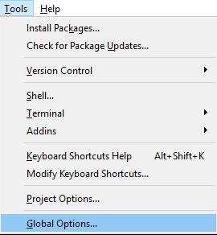
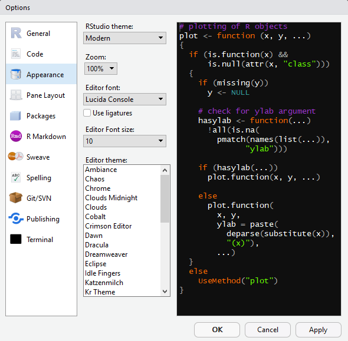

# Appendices {-}

## Changing the Appearance of RMarkdown {-}

Spending any significant amount of time in front of a computer, especially in front of black text on a white background, can be headache inducing. Also, if your eyesight is not great, the effect can be multiplied and stressful. 

You can change the appearance of RMarkdown, and many of us who spend hours on it usually do.

If you wish to change the appearance you can go to the tools menu and select "Global Options":

<center></center>

Next, click "Appearance" in the box on the left:

<center></center>

Here you can change the Editor font, font size and the editor theme (the colours of the text). Make the selections you want and then press "Apply" to make them stick.

```{block, type = "warning"}
Changing the "zoom" to too big a size can make it *extremely* difficult to use the software or to even change it back. 

Edit the **font size** and only tinker with the zoom when absolutely neccessary!
```

## Source Materials {-}

This course has been remixed from the following sources.

If you wish to further your reading we would advise looking over these sources yourself. They are aimed at a variety of different level students, thus they may move a little faster and have greater expectations of prior knowledge.

* Our Level 1 Data Skills Handbook [@l1book]

## Further Reading {-}

### Statistics {-}

#### Learning the General Linear Model {-}

For those who have some knowledge of statistics who wish to gain a wider understanding of the General linear model framework we recommend Miller and Haden [-@millerandhaden]. [This textbook](https://www.freetechbooks.com/statistical-analysis-with-the-general-linear-model-t1303.html) is also open source and free to download and is the book that we recommend to our **third year** psychology students. 

### More Advanced Use of R {-}

For those who are looking to read in more detail about what we have been doing in this class:

* R for Data Science [@rfordatascience].

For those who want to use RMarkdown to publish documents:

* Bookdown: Authoring Books and Technical Documents with RMarkdown [@xie2015]. This course book was written using this package.
* RMarkdown Websites [@rmarkdownweb].

# References